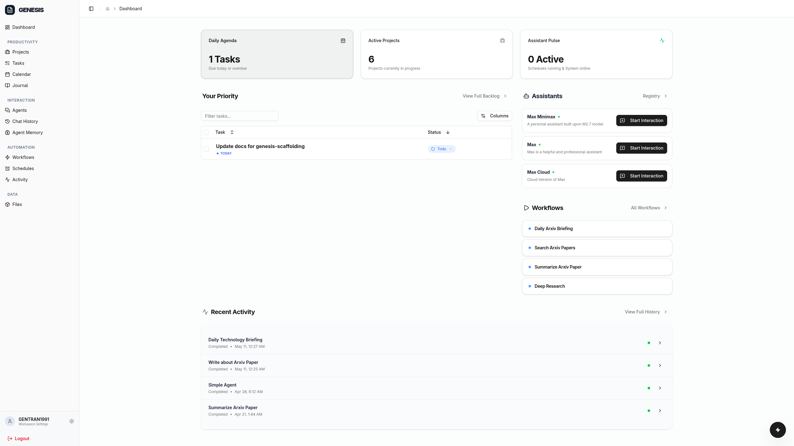
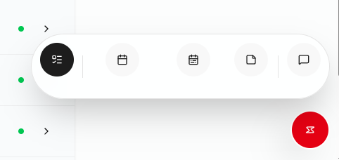
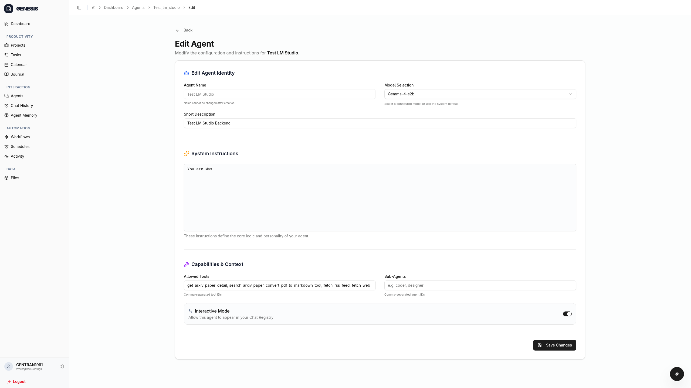
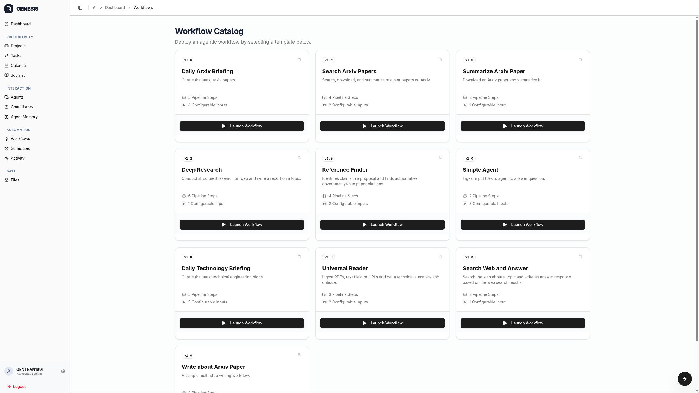
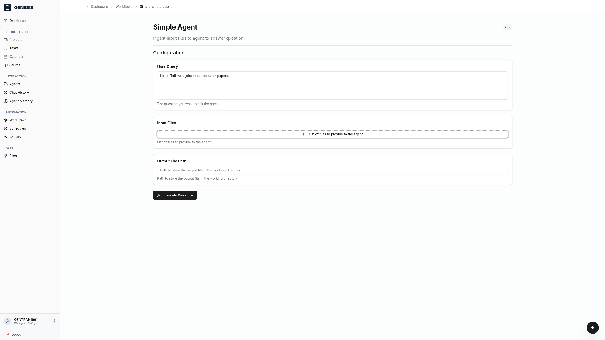
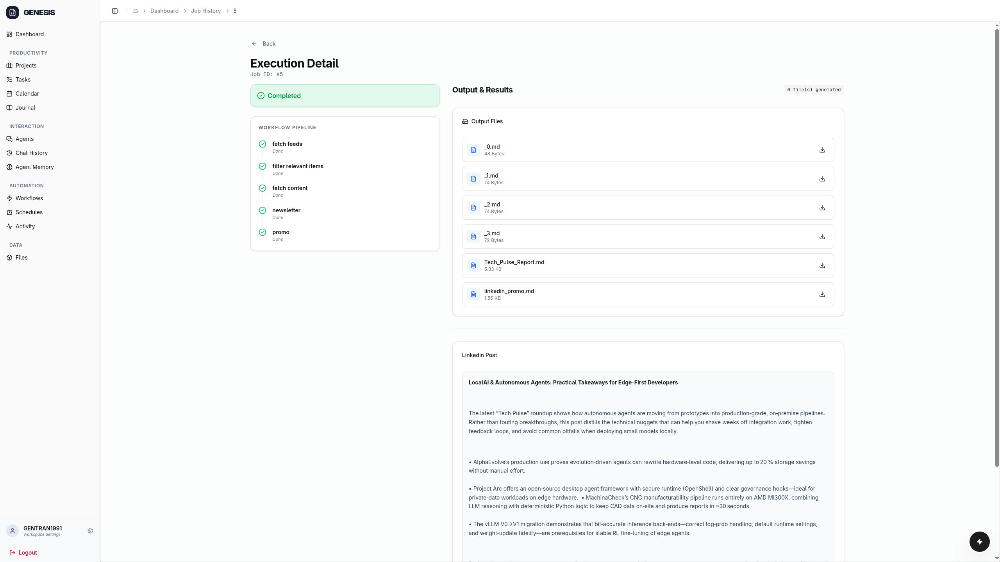
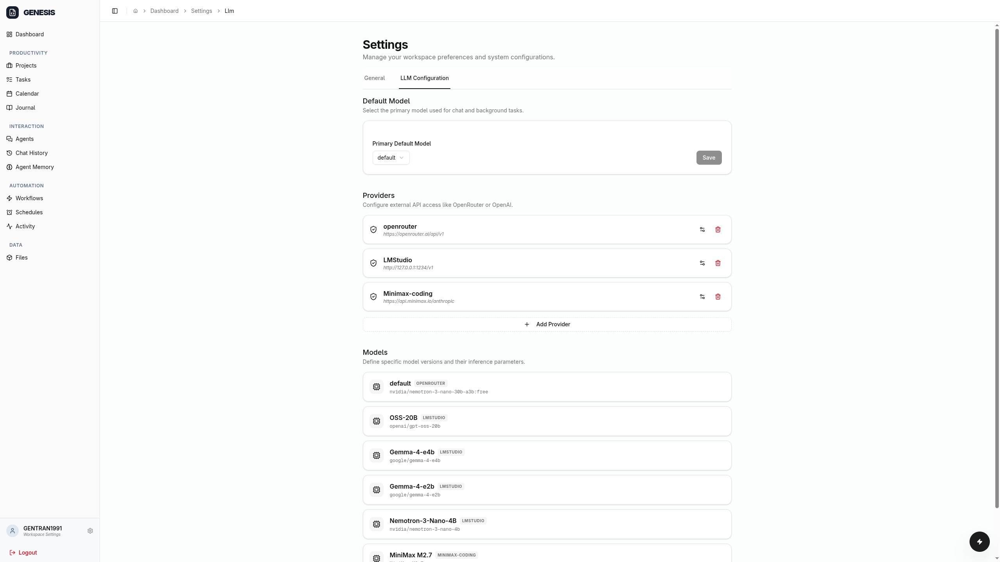
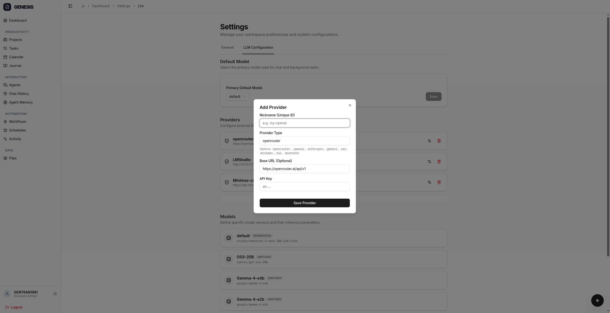
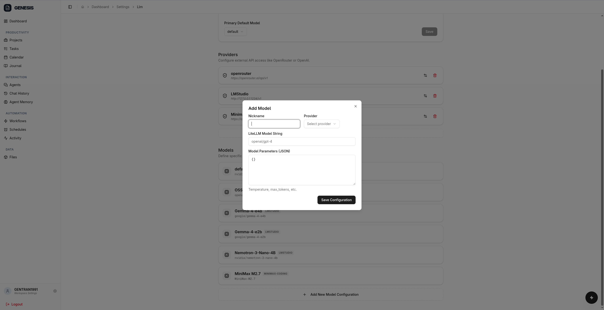

# Genesis Scaffolding

<p align="center">
  
</p>

---

Genesis Scaffolding (`genesis-scaffolding`) is a scaffolding and an agent framework for building your own *full-stack agentic applications*. Use the existing monorepo structure and build scripts to bootstrap a web application quickly. Add interactive LLM-based agents within your application with the built-in agent framework. Leverage the built-in workflow engine and scheduler to put agents to work on repetitive processes within your app.

`genesis-scaffolding` is usable out of the box as **a web-based productivity system that is fully accessible and controllable by AI agents**. The goal is to give everyone access to an "executive personal assistant" that they can own and host by themselves. 

We developed and tuned the system with `nemotron-3-nano-30b-a3b` model to ensure that the system would work with smaller MoE models that can be deployed on consumer GPU with RAM offloading.

## Table of Contents

- [Quick Start](#quick-start)
- [Provider Support](#provider-support)
- [Using the Personal Productivity Web GUI](#using-the-personal-productivity-web-gui)
  - [Productivity Subsystem](#productivity-subsystem)
  - [Create and Edit Agent](#create-and-edit-agent)
  - [Run workflows](#run-workflows)
  - [Add LLM provider and models](#add-llm-provider-and-models)
- [Settings and important paths](#settings-and-important-paths)
  - [Important paths](#important-paths)
- [Why build this?](#why-build-this)
- [Roadmap](#roadmap)
- [Contributing and Development](#contributing-and-development)
- [License](#license)

---

## Quick Start

**Acquire the source code**

```bash
git clone https://github.com/nguyentran0212/genesis-scaffolding
cd genesis-scaffolding
```

**Create the `.env` file.** Specify your LLM provider and default LLM model to be used by the system. See the provider section below for the list of supported providers.

``` bash
# Use the env template
cp .env.example .env
```

**Build and run docker image.** The state of the system is stored in `genesis_data` and `user_directories_data` volumes and preserved between docker runs

```bash
docker compose up -d
```

**Alternatively, run the project on bare metal.** You need to have `uv`, `pnpm`, and `make` installed on the machine.

```bash
make setup # install dependencies
make run # run the code in production mode
```

The frontend would be available at `localhost:3000`.

The backend SwaggerUI would be available at `localhost:8000/docs`

---

## Provider Support

`genesis-scaffolding` uses a combination of `LiteLLM` and `anthropic-sdk` to support both OpenAI-compatible and Anthropic-compatible providers. The following have been tested and used during the development and user testing of the system.

- OpenRouter
- Google AI Studio
- MiniMax Coding Plan
- ZAI Coding Plan
- `llama.cpp` OpenAI-compatible server

See [docs/providers.md](docs/providers.md) for detailed setup instructions.

---

## Using the Personal Productivity Web GUI

<p align="center">
  
</p>

The dashboard provides at-a-glance information and quick access to commonly used features. From the top:

- *Statistics* regarding tasks, projects, and scheduled workflows
- *Your Priority*: scheduled, upcoming, and overdue tasks that require attention
- *Assistants*: start chat session with pinned AI assistants
- *Workflows*: quickly start a new commonly used workflow
- *Recent Activity*: a log of recent workflow runs

The side bar provides access to primary sub-systems:

- *Productivity*: provide access to projects, tasks, calendar, and journal. Each user has a separate database to store their productivity data
- *Interaction*: create and start chat session with agents, access previous chat sessions, and review the persistent memory that is shared across agents
- *Automation*: start new workflow run, schedule a workflow run as CRON job, and review the results of previous workflow runs.
- *Data*: browse the files and directories in the file sandbox. Each user a separate file sandbox, which is accessible by their agents
- *Workspace Settings*: adding and modifying LLM providers and LLM models to be used by agents

<p align="center">
  
</p>

The quick action button at bottom right provides quick access to commonly done activities:

- *Add task*
- *Open today's journal entry*
- *Open this week's journal entry*
- *Open a generic note*
- *Start a chat with a pinned agent*

### Productivity Subsystem

`genesis_scaffolding` uses three types of entities to help you document and manage your affairs:

- *task* represents an action or outcome that you need to do. When a task is assigned with a specific date and time, it becomes a *calendar appointment*
- *project* represents a larger outcome that requires multiple actions to complete. A project contains tasks and journal entries
- *journal entries* captures logs, plans, project-specific notes, and any other things that you want to write down. The system recognizes and supports *daily notes*, *weekly notes*, *monthly notes*, *yearly notes*, and *project notes* out of the box

If authorised, agents can read, edit, and update your productivity data. You can use this ability to implement features such as

- *daily briefing*: have the agent to prepare a morning briefing about your affairs
- *nightly reflection*: have a free form conversation with your agent and have it note down the reflection in a daily journal
- *long horizon planning*: conduct weekly, monthly, and yearly review and planning session with your agent and record the decisions in relevant journal entries

See [docs/productivity_subsystem.md](docs/productivity_subsystem.md) for details about architecture and implementation of these productivity data.

See [docs/using_productivity_subsystem.md](docs/using_productivity_subsystem.md) for more details about the rationale behind the design of productivity subsystem and a suggested workflow.

### Create and Edit Agent

<p align="center">
  
</p>

An agent is a wrapper around an LLM. It can call multiple tools to gather information and act upon its surrounding environment. 

You can interact with agents directly via a chat window. Agents can also be invoked as a step in a workflow.

You can configure the following aspects of an agent:

- *Identifier*: Name and short description for identifying agent
- *Model*: the LLM to power the agent
- *System instructions*: the persona and other instructions regarding the behaviour of the agent
- *Allowed tools:* A list of tools that the agent is allowed to call
- *Sub-agents*: A list of agents that the current agent is allowed to spawn
- *Interactive mode*: interactive agents can be used in chat session. Non-interactive agents are only used in workflows

Agents are defined as markdown files at the backend. See [docs/agent_manifests.md](docs/agent_manifests.md) for details.

### Run workflows

<p align="center">
  
</p>

<p align="center">
  
</p>

<p align="center">
  
</p>

A workflow is a predefined sequence of steps that take inputs and generate outputs. 

Run an existing workflow by selecting it from the list and provide inputs. Some workflows also support attaching files from user's sandbox directory.

Workflows are designed to follow *map-reduce* pattern. Workflow steps create and consume a list of input items. The *map* step works on input items separately to generate output. The *reduce* step works on input items at once to generate one or more output items. Both types of steps can invoke LLM agent as a part of its logic. See [docs/workflow_architecture.md](docs/workflow_architecture.md) for details.

You can define workflows with YAML files. See [docs/workflow_manifest.md](docs/workflow_manifest.md) for instructions.

### Add LLM provider and models

<p align="center">
  
</p>

<p align="center">
  
</p>

Access the LLM configuration by selecting *Workspace Settings* and then *LLM Configuration* tab.

Add a new provider by selecting the *Add Provider* button and fill in the form:

- *Nickname*: an easy-to-remember name for your reference
- *Provider Type*: this tells the framework the type of LLM provider to ensure it uses correct interface type
- *BaseURL*: you can keep this field empty for well known providers like OpenAI and Anthropic. Otherwise, set it to where your LLM provider exposes the API endpoint
- *API Key*

<p align="center">
  
</p>

Add a new model by selecting the *Add New Model Configuration* button and fill in the form:

- *Nickname*: an easy-to-remember name for your reference
- *Provider*: select from one of the created providers in the dropdown list
- *LiteLLM Model String*: the name of the model, set by provider. If you use models from Open Router, add the full path (e.g., `openai/gpt-5`). If you use model from other providers, you might only need to supply the model name (e.g., `MiniMax-M2.7`)
- *Model Parameters*: a JSON objects containing parameters for the sampling and inference process

See [docs/llm_client.md](docs/llm_client.md) for details about the architecture of LLM client.


---

## Settings and important paths

`genesis-scaffolding` uses `.env` and `config.yaml` for configuration, such as LLM providers and LLM models. We supports both server-wide and user-specific settings.

| Location | Scope | 
| --- |--- |
| `<cwd>/.env` | Server-wide settings | 
| `<cwd>/user_directories/<user_id>/config.yaml` | User-specific settings | 


See [docs/settings.md](docs/settings.md) for a list of available settings.

### Important paths

`genesis-scaffolding` uses the following directories for maintaining its state and storing user's data

| Location | Content |
| --- | --- |
| `<cwd>/.genesis/` | Server-side state and manifests | 
| `<cwd>/.genesis/database/genesis.db` | Server-wide state database |
| `<cwd>/user_directories/<user_id>/.genesis/` | User-specific state and manifests |
| `<cwd>/user_directories/<user_id>/.genesis/user_private.db` | Productivity database for current user |
| `<cwd>/user_directories/<user_id>/.genesis/user_memory.db` | Agent's memory for current user |
| `<cwd>/user_directories/<user_id>/.genesis/agents/` | Agent manifests of current user |
| `<cwd>/user_directories/<user_id>/.genesis/workflows/` | Workflow manifests of current user |
| `<cwd>/user_directories/<user_id>/.genesis/workspaces/<workflow_id>/` | Output artefacts of a workflow of current user |


---


## Why build this?

Ever since my first deployment of local LLM with Mistral 7B, Llama 3 8B, and Nous-Hermes models back in early 2024, I have been fascinated by one problem: *"what if the LLM can actual do what it hallucinates that it can do, when it roleplay as an executive assistant?"*

I realised that if LLM can query an external system for my productivity data, and if LLM can see the output from the external system to adjust its own plan and response on the fly, then it is possible to run LLM in a loop in a way that it can be have like an intelligent assistant that can get things done. Back in early 2024, tool calling was far from usable with small local models, and cloud models, to me, are not really an attractive choice to build an personal assistant. Therefore, I resigned to focus on productivity and knowledge management systems instead.

Flash forward to 2025. We have 30B MoE models that can run locally at decent speed and have decent tool calling capability. They are also "smarter" with built-in ReACT and chain of thought due to model post-training regiments. At the same time, there is also a boom of LLM agents. So, I figured it is time to revive the old problem.

**Why build agent framework from scratch?** LLM agents are simple at the concept level, though they can be quite complex at the engineering level. Each framework has different assumptions and interests, leading to different design decisions that can be quite opaque. The need to support many emerging standards and conventions like `agents.md`, `agent skills`, `mcp`, make the code even more complex and harder to understand how everything fits with everything else. Therefore, I set it as a challenge and learning opportunity to build everything from the ground up with as few dependencies as possible. Another advantage of building my own framework is the ability to test new ideas to optimise agents (see [docs/agent_clipboard.md](docs/agent_clipboard.md)).

**Why scaffolding rather than library?** I think there is still a big gap between a library and even a simple application (repository structure, backend tech, frontend tech, build process, authentication, database, etc.). Crossing this gap requires human developers or AI coding agents to think and make the same set of decisions again and again. So, what if build something runnable out of the gate with all of these decisions already made, so that developers (including my future self) can hit the ground running? You can still customize everything, but I provide a set of pre-made choices that at least work for me, so you can start building your own.

**Why put productivity subsystem in the scaffolding?** Because I actually deploy and use this scaffolding system itself as my personal productivity system.


---

## Roadmap

- [x] Setup monorepo, configuration, and initial build process
- [x] Develop FastAPI scaffolding, frontend scaffolding, and support for SSE streaming
- [x] Design and develop the core agent loop and agent manifests
- [x] Develop the workflow engine and built-in workflow tasks
- [x] (Experimental) Develop the agent clipboard mechanism
- [x] Develop user's productivity data store
- [x] (Experimental) Develop persistent memory for agents
- [ ] Refactor the agent's core to provide a consistent API for future development
- [ ] Implement the ability to import / export / restore user data
- [ ] Implement tool call permission gateway
- [ ] Support agent skills
- [ ] Explore and implement stronger sandboxing strategy
- [ ] Explore and implement a secure vault for credentials to support use cases such as Google OAuth

Wishlist:

- [ ] Implement LLM-Wiki in the demo app of the scaffolding
- [ ] Give agents access to mailboxes via OAuth
- [ ] Implement SSO as alternative to current password-based authentication flow
- [ ] Support MCP

---

## Contributing and Development

See [CONTRIBUTING.md](CONTRIBUTING.md) for guidelines.

See [docs/development.md](docs/development.md) for setup and running. See [docs/architecture.md](docs/architecture.md) for a high-level overview of the architecture of `genesis-scaffolding` and its subcomponents.

---

## License

AGPL-3.0

