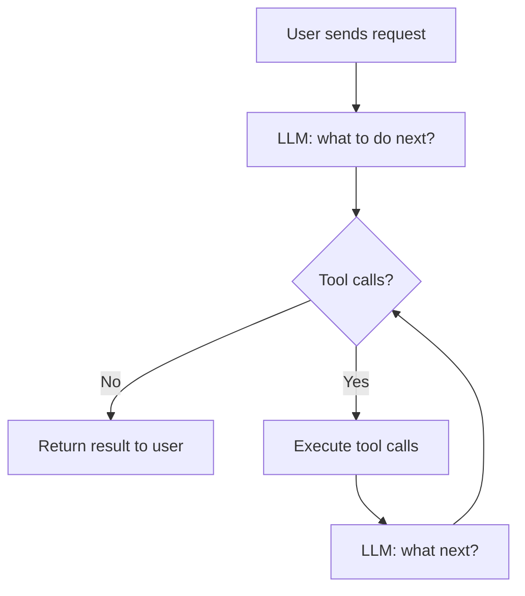
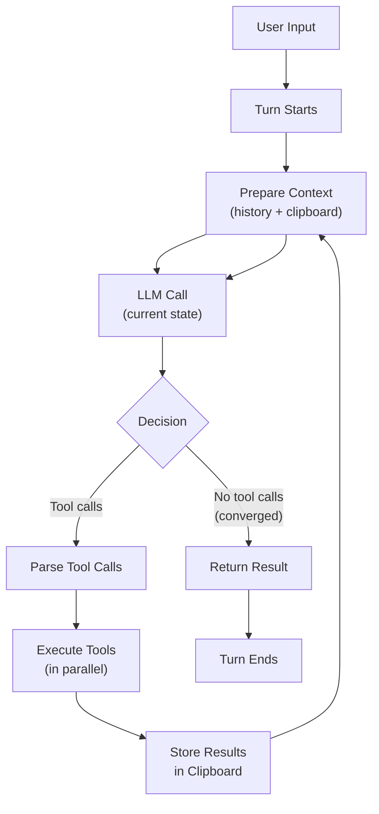
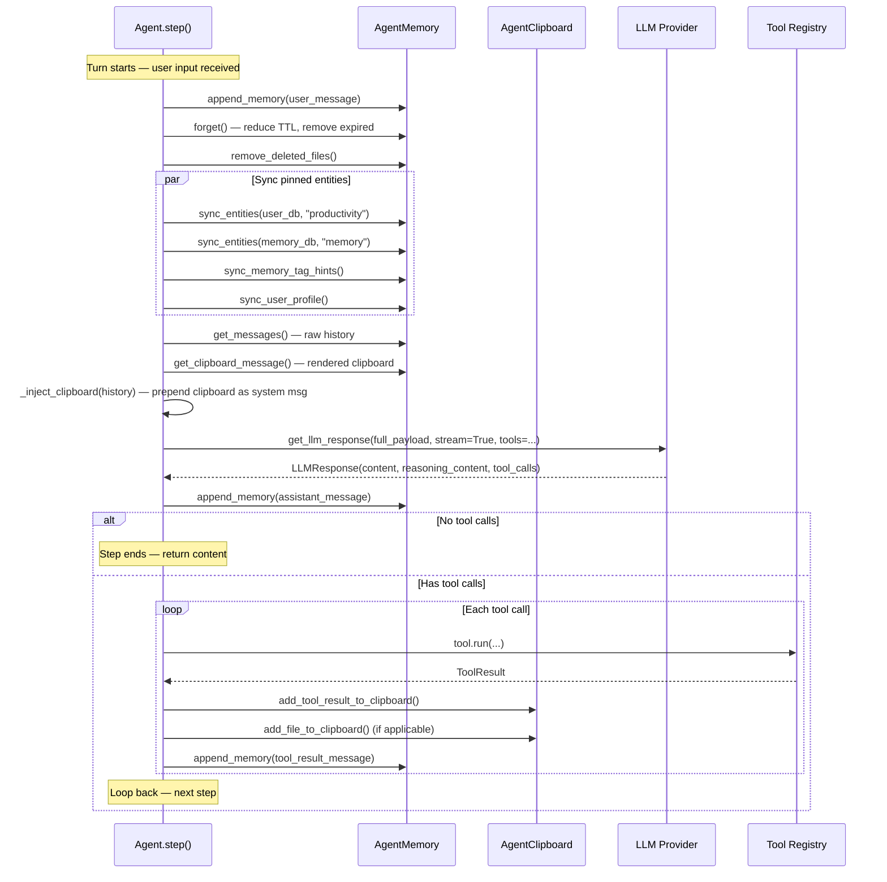

# Agent Loop Architecture

## Concepts

At the heart of the LLM agent is a loop. Each iteration asks the LLM: given the current state, what should we do next?




This is the **ReACT** pattern (Reasoning + Acting). Modern LLMs are post-trained to generate structured tool calls when they need to perform actions, so the loop converges toward goals reliably.

**Turns vs steps** — a turn starts when the user sends a request and ends either successfully or with a failure condition (max steps reached, provider error, loop detected). Each turn contains multiple steps, where each step is one LLM call. The loop iterates until the LLM stops requesting tools.

**Agent vs harness** — the LLM drives the execution, so we call it the agent. The software loop that wraps around it (preparing context, executing tools, managing memory) is the harness. The harness does what the LLM decides; it does not drive the flow.

**Context** — the state sent to the LLM on every call. This state is a string, generally formatted as a chat message list.

## Design challenges and design decisions

### Challenge: keeping context in check without breaking prompt caching

The main challenge is keeping useful context in the LLM (files, tool results, pinned entities) without blowing up the message history beyond what the LLM can handle or afford.

An obvious solution is to remove all the duplicated file reads and outdated tool calls in the message history.

However, removing them naively from the context are bad because:

- The prompt caching would break, forcing LLM provider to process the whole string again. Prompt processing can lead to unusable latency and costs.
- Randomly removing content from context can break the perceived history of the model, leaning to degraded performance.

#### Design decision: ephemeral clipboard injected near the latest message

The key design is the **clipboard**. It is an ephemeral data structure that gets injected into the LLM context as a single system message, as close to the latest message as possible, without modifying the message history.

```
[system prompt, ..., history messages, CLIPBOARD MESSAGE]
                                          ↑
                                   injected here
                                   each step fresh
```

Placing clipboard content here means:
- The natural message flow stays intact (user, assistant, tool, assistant, ...).
- The LLM can reason about the conversation properly.
- History is preserved so the LLM can follow the logical progression.
- Clipboard content gets refreshed every step without rewriting history.



#### Supporting decisions to make clipboard possible

**Tool call results are lightweight confirmations, not payloads.** The tool returns a short confirmation (e.g., "File written successfully, check the clipboard") rather than dumping the full result into the tool response. Heavy data lives in the clipboard. This keeps tool responses short and predictable, and avoids cache invalidation.

**Live sync of pinned entities.** Pinned entities (tasks, projects, journals, memory events) are synced from their databases every step before the LLM call. The agent always sees current state, not stale data from the start of the turn.

**TTL-based resolution decay.** Clipboard items have a time-to-live measured in steps. As TTL counts down, pinned entities downgrade from "detail" to "summary" resolution, cutting token cost for older context while keeping recent data rich.

```
TTL = 10  →  full detail
TTL ≤ 5   →  downgrade to summary
TTL = 0   →  remove from clipboard
```

### Challenge: observing the loop from the outside

The agent loop runs asynchronously over potentially long durations. External clients (the web UI, a workflow runner) need to see what is happening inside the loop without interrupting it.

#### Design decision: callbacks at major loop points

The loop emits callbacks at well-defined points:

| Callback | When |
|----------|------|
| `content_chunk_callbacks` | Token by token from the LLM response |
| `reasoning_chunk_callbacks` | Reasoning content from models that emit it |
| `tool_start_callback` | When a tool call starts executing |
| `tool_result_callback` | When a tool finishes |

These callbacks are registered at agent creation time. Token streaming in the web UI uses them. Tokens flow to the browser via SSE as they arrive from the LLM, not after the full response is done.

## Technical details

### Data flow of a single step



### Clipboard injection

`_inject_clipboard()` inserts the clipboard as a system message just before the last user message (or appends to the last tool result). This keeps message ordering intact while making clipboard content available to every LLM call.

```python
def _inject_clipboard(self, history):
    clipboard_msg = self.memory.get_clipboard_message()
    if history[-1]["role"] == "tool":
        # Append to last tool result
        return history[:-1] + [modified_tool_result_with_clipboard]
    # Otherwise prepend before last user message
    return history[:last_user_index] + [clipboard_msg] + history[last_user_index:]
```

### Tool execution

Tools run in parallel via `asyncio.gather`. Each tool:
1. Runs via `tool.run(working_directory, user_db_url, memory_db_url, timezone, **args)`
2. Returns a `ToolResult` with four channels:
   - `tool_response` — short confirmation string for the LLM history
   - `files_to_add_to_clipboard` — files to load into the clipboard
   - `results_to_add_to_clipboard` — strings to add as tool results in clipboard
   - `entities_to_track` — productivity/memory entities to pin

### Loop termination conditions

| Condition | Outcome |
|-----------|---------|
| LLM returns no tool calls | Return content, turn ends |
| Max turns reached (`max_turns=20`) | Return max turns message |
| Same tool calls repeated (`max_repetitions=3`) | Terminate with loop detection message |
| LLM provider error | Exception propagates, turn fails |

## See also

- [agent_manifests.md](./agent_manifests.md) — agent manifest format, how agents are defined
- [agent_clipboard.md](./agent_clipboard.md) — clipboard mechanism details
