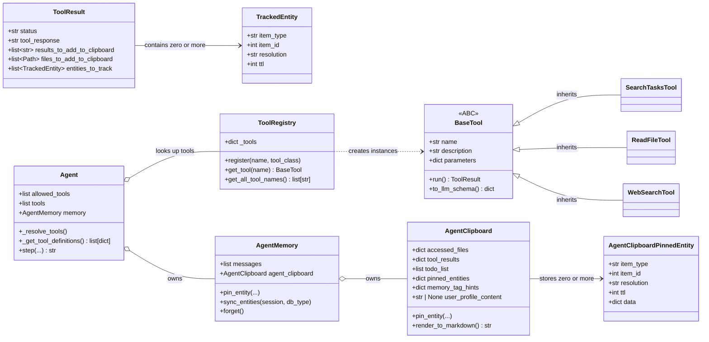
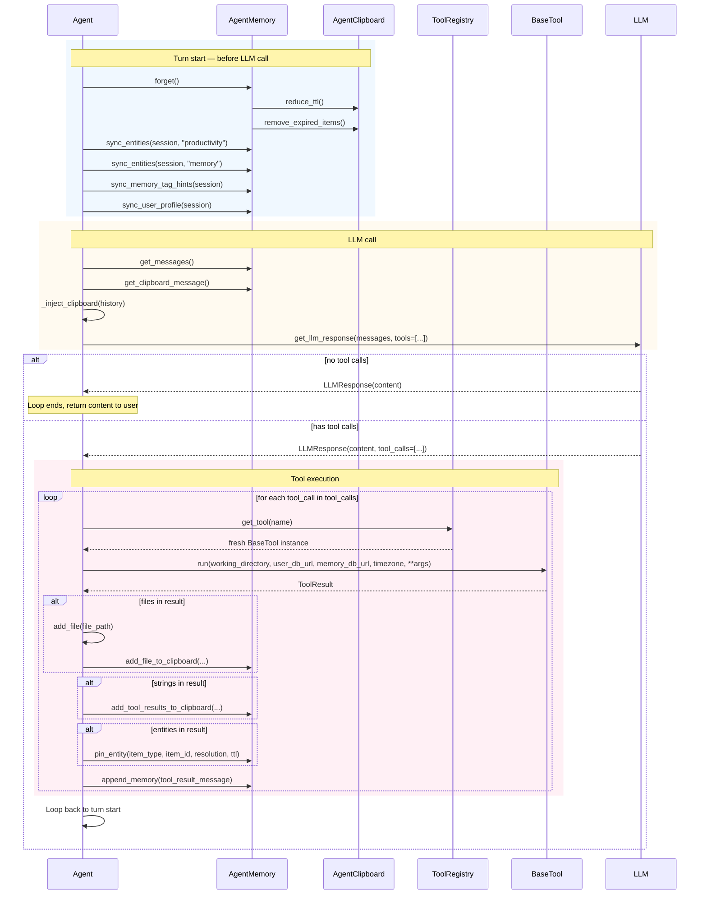
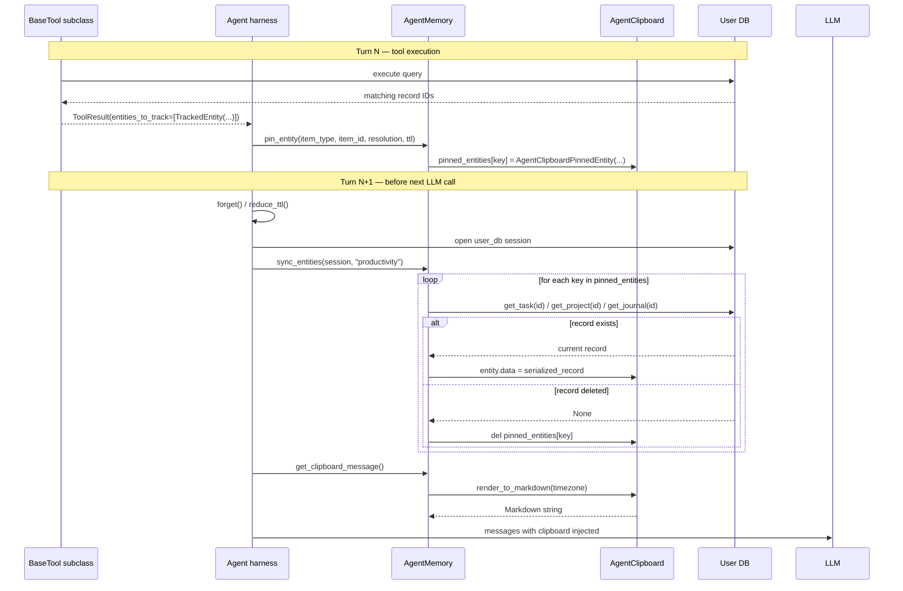

# Agent Tools Architecture

## Overview

This document describes the architecture of how we design and implement tools for the agent system. It covers the tool class hierarchy, the schemas used for tool input and output, how tools are discovered and prepared for the LLM, and the runtime lifecycle of tool execution including the entity pinning mechanism. Use this as a reference when implementing new tools.

## What a tool is

For an LLM agent, a tool is the mechanism that lets the agent interact with the outside world. Instead of just generating text, the agent can call functions to get information, read files, search the web, or update records.

Here is how it works, from the LLM provider's perspective:

1. The tool schemas are injected into the system prompt so the LLM knows what tools are available.
2. When the LLM decides to call a tool, it generates a structured output (usually JSON) describing the tool name and arguments.
3. The LLM provider parses this and returns a tool call request object to the harness code.
4. The harness executes the requested function and returns the result to the LLM via a special tool response message.
5. The LLM receives the result and can either continue calling tools or finish with a text response.

This pattern is common across agent implementations. The rest of this document focuses on the parts that are specific to our system.

## Where our tools are different

Our tool system has a feature called entity pinning. When a tool searches for a task, journal, or memory entry, it does not dump the full records into the tool response text. Instead, it signals to the agent harness that certain entities should be pinned to the clipboard. The clipboard is a short-term context space that gets injected into the LLM prompt every turn. By pinning entities instead of embedding them directly in tool results, the agent can access them selectively over multiple turns without bloating the message history.

Because of this, a tool in our system produces more output than just a string to return to the LLM. A tool can also declare files to add to the clipboard, strings to add to the clipboard, and entities to track. All of this extra output is handled by the agent harness after the tool runs.

## Static architecture

### Class relationships



### Tool base class

```python
BaseTool (ABC, genesis-tools/src/genesis_tools/base.py)
```

Every tool inherits from `BaseTool`. Subclasses must define three class attributes:

- `name` — the string identifier used in tool call requests from the LLM.
- `description` — a human-readable description shown to the LLM so it knows when to call this tool.
- `parameters` — a JSON Schema dict describing the arguments the tool accepts.

The abstract method `run()` does the actual work and returns a `ToolResult`.

### Framework-injected inputs

When the agent harness calls a tool, it always passes four additional arguments alongside the tool-specific ones from the LLM. These are not part of the tool's JSON Schema and are available to every tool via `**kwargs` in the `run()` signature:

- `working_directory: Path` — the root directory the agent is allowed to operate in. Tools use this for path validation.
- `user_db_url: str | None` — connection string to the user's productivity database. `None` if the productivity subsystem is not enabled.
- `memory_db_url: str | None` — connection string to the user's memory database. `None` if the memory subsystem is not enabled.
- `timezone: str` — the user's configured timezone for rendering dates and times.

### Tool output schemas

Two Pydantic models define the output contract.

**`ToolResult`** — the one return type for all tools:

```python
ToolResult
├── status: "success" | "error"
├── tool_response: str                        # main output or error message
├── results_to_add_to_clipboard: list[str]    # string content to inject into clipboard
├── files_to_add_to_clipboard: list[Path]     # files to load into clipboard
└── entities_to_track: list[TrackedEntity]   # DB entities to pin to clipboard
```

**`TrackedEntity`** — the signal to pin a database entity:

```python
TrackedEntity
├── item_type: "task" | "project" | "journal" | "memory_event" | "memory_topic"
├── item_id: int
├── resolution: "summary" | "detail"   # controls how much detail renders in clipboard
└── ttl: int = 10                       # turns until the pin expires
```

### Tool registry

```python
ToolRegistry (genesis-tools/src/genesis_tools/registry.py)
├── register(name, tool_class)   # registers the class; overwrites tool_class.name to match the key
├── get_tool(name) -> BaseTool   # returns a fresh instance each call
└── get_all_tool_names() -> list[str]
```

`get_tool()` always returns a new instance. Tools are stateless between calls. Any state that needs to persist across a session must come from the parameters passed to `run()` such as `user_db_url` and `timezone`.

A global `tool_registry` instance is pre-populated with all tool registrations at module load time.

### Clipboard data model

The clipboard lives inside `AgentClipboard` and holds five types of data:

| Sub-model | Purpose |
|---|---|
| `AgentClipboardFile` | Files read or edited by the agent. Tracks current and previous content, TTL, and flags for new or edited status. |
| `AgentClipboardToolResult` | Tool call outputs. Stores the tool name, call ID, result strings, and TTL. |
| `AgentClipboardTodoItem` | Agent's internal scratchpad todos. Not used by tools directly. |
| `AgentClipboardPinnedEntity` | DB entities pinned by tools. Holds `data` dict which is updated every turn from the DB. |
| `memory_tag_hints` | Tag counts from the memory DB. Updated every turn by the agent loop. |

`pinned_entities` is a dict keyed by `"{item_type}_{item_id}"`, for example `"task_42"`. Each entry holds a `data` dict that gets refreshed from the database every turn via the sync step.

## Tool preparation

Before the agent can use any tools, they must be resolved and formatted for the LLM.

### Discovery

When an `Agent` is created, it reads the `allowed_tools` list from its config. For each tool name in that list, it calls `tool_registry.get_tool(name)` which returns a fresh `BaseTool` instance. These instances are stored in `Agent.tools`.

### Schema translation

When the agent needs to call the LLM, it calls `_get_tool_definitions()` which calls `to_llm_schema()` on each tool. That method returns a dict in the OpenAI function-calling format:

```python
{
    "type": "function",
    "function": {
        "name": self.name,
        "description": self.description,
        "parameters": self.parameters,
    },
}
```

This list of function definitions is passed to the LLM with every request so the model knows what tools are available and what arguments each tool expects.

## Tool call lifecycle

Here is what happens during one turn of the agent loop.



### 1. Before calling the LLM

The agent calls `memory.forget()` which decrements TTL on all clipboard items and removes any that have expired. For pinned entities, the TTL decrement also triggers a downgrade: if the TTL falls to 5 or below, the resolution automatically changes from `"detail"` to `"summary"`.

The agent then opens DB sessions and calls `sync_entities()` for each pinned entity type that has a live entry in the clipboard. This fetches the current state of each entity from the database and stores it in `entity.data`. If an entity has been deleted from the DB, it is removed from the clipboard.

### 2. Calling the LLM

The agent builds the message history and injects the clipboard as a system message using `_inject_clipboard()`. The clipboard is attached to the last tool response message, or just before the last user message if there is no tool result yet. This gives the LLM fresh context without bloating the stored message history.

The LLM receives the messages and decides whether to return a text response or request tool calls.

### 3. Tool execution

For each tool call in the LLM response, the harness calls `_execute_tool_and_format()`. This looks up the tool by name from `self.tools`, runs it with the provided arguments, and processes its `ToolResult`:

- If `files_to_add_to_clipboard` is present, each file is read and added to the clipboard.
- If `results_to_add_to_clipboard` is present, the strings are added to the clipboard under the tool call ID.
- If `entities_to_track` is present, each `TrackedEntity` is passed to `memory.pin_entity()` which calls `clipboard.pin_entity()`. This adds or updates the entity entry in `clipboard.pinned_entities`.

The function returns a `"role": "tool"` message dict that is appended to the message history and sent back to the LLM on the next call.

Tools are executed in parallel using `asyncio.gather()`.

## Entity pinning

### Intent and flow



The pinning mechanism lets tools declare that certain DB entities should be accessible to the agent via the clipboard, rather than embedding the full record in the tool response text. This keeps tool results concise and allows the agent to access entity data across multiple turns.

Here is the full flow for a tool that pins an entity:

1. The tool executes a database query and collects the IDs of matching records.
2. The tool returns a `ToolResult` with `entities_to_track` set to a list of `TrackedEntity` objects, one per ID. The `resolution` field is set to `"summary"` for search results or `"detail"` for single-record reads.
3. The agent harness iterates over `entities_to_track` and calls `memory.pin_entity()` for each.
4. `pin_entity()` creates or updates an `AgentClipboardPinnedEntity` entry in `clipboard.pinned_entities` keyed by `"{item_type}_{item_id}"`.
5. At the start of the next turn, before calling the LLM, the agent opens a DB session and calls `sync_entities()`.
6. `sync_entities()` iterates over all pinned entities in the clipboard. For each one, it queries the database to fetch the current record and stores the serialized data in `entity.data`.
7. The clipboard renders these pinned entries as Markdown into the system message. In summary mode, only key fields like title, status, and ID are shown. In detail mode, description, content, and other fields are included.
8. When the entity TTL expires or the entity is deleted from the DB, it is removed from the clipboard on the next sync.

### TTL decay

Every turn, `forget()` decrements the TTL on all clipboard items. When TTL reaches zero, the item is removed. For pinned entities, there is an additional decay step: at TTL 5, the resolution downgrades from detail to summary. This automatically reduces the token cost of older pinned entities without removing them entirely.

## Known limitations

### Schema translation lives in the agent

The agent harness currently calls `to_llm_schema()` directly on tool instances to build the function definitions. This means the agent code must know about this method and call it explicitly. Ideally, the registry or a factory function would handle this, but the current design requires the agent to orchestrate this step.

### Entity type names are hardcoded

The `item_type` values (`"task"`, `"project"`, `"journal"`, `"memory_event"`, `"memory_topic"`) and the logic to handle each type in `sync_entities()` are written directly into the framework code. Adding a new entity type requires changing code in multiple places: the `TrackedEntity` schema, the `clipboard.pin_entity()` signature, and the `sync_entities()` case statement. This is not extensible without modifying the core modules.

### Resolution downgrade is a heuristic

The rule that detail level degrades to summary when TTL falls to 5 is a fixed heuristic. There is no way for a tool or the user to override this behavior or tune the threshold. This may not match the actual token budget situation for a given prompt.
