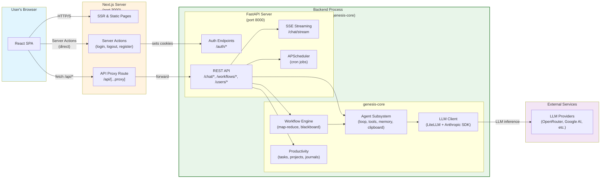
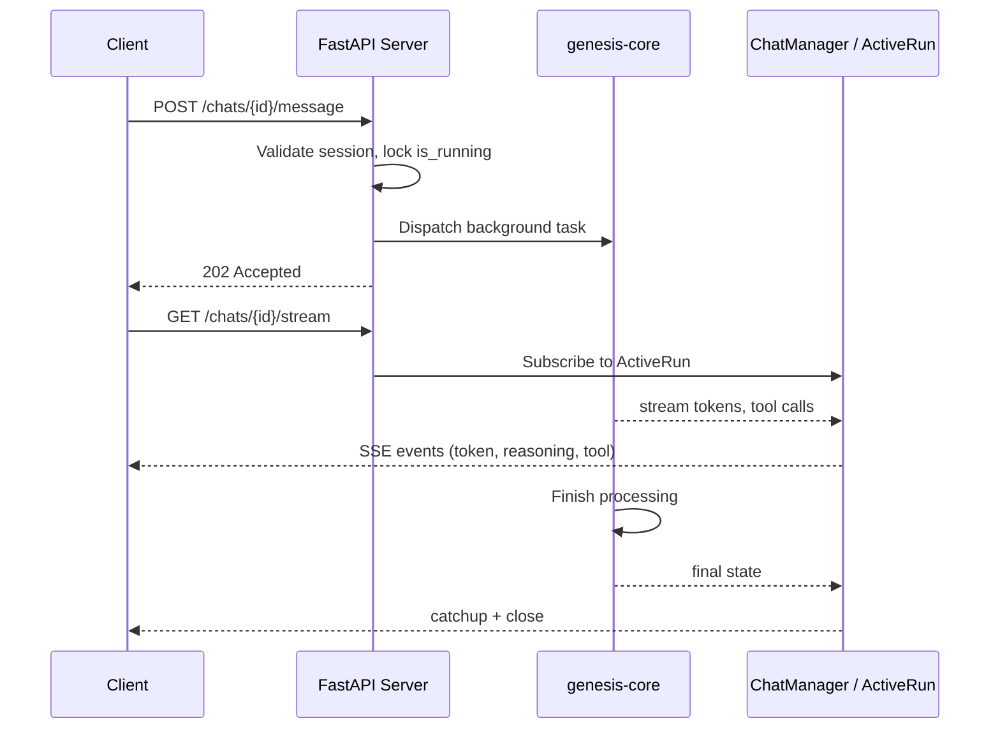

# Architecture

## Runtime architecture

At runtime, the system comprises three processes: the FastAPI server, the NextJS server, and ReactJS components sitting in user's web browser. The system also calls external LLM providers for LLM inference necessary to drive the agents.



### Bidirectional communication with SSE

Some operations produce output over an extended period — streaming LLM tokens, live workflow progress, or long-running agent tasks. Rather than holding an HTTP connection open for minutes, the system uses a two-phase pattern:

1. **POST** — client sends a request (e.g., send a chat message)
2. **202 Accepted** — server immediately returns with a reference ID and starts background work
3. **GET /stream** — client opens a separate SSE endpoint using that ID to receive real-time events



This pattern is used for:
- **Chat streaming** — tokens and reasoning chunks delivered as SSE events while the agent runs
- **Workflow progress** — step start/complete/failed events broadcast to subscribed clients

## Package architecture

The repository is a monorepo with Python backend and TypeScript frontend as separate workspaces.

```
genesis-scaffolding/
├── pyproject.toml           # uv workspace root — manages Python packages
├── Makefile                 # Build, dev, and test commands
├── genesis-core/            # Core Python library — agent, LLM, workflow, productivity
├── genesis-tools/           # Tool implementations — file, web, arxiv, productivity
├── genesis-server/          # FastAPI REST API — routers, auth, scheduler
├── genesis-cli/             # CLI entrypoint (single-user mode)
├── genesis-tui/             # Terminal UI (stub)
└── genesis-frontend/        # Next.js React app — separate Node workspace
```

**Python packages** — managed by uv workspace in `pyproject.toml`:

| Package | Role | Depends on |
|---------|------|-------------|
| `genesis-core` | Shared logic — agent loop, LLM client, workflow engine, productivity models | — |
| `genesis-tools` | Tool implementations for agents | genesis-core |
| `genesis-server` | FastAPI API | genesis-core, genesis-tools |
| `genesis-cli` | CLI commands | genesis-core |
| `genesis-tui` | Textual TUI (stub) | genesis-core |

**Frontend** — separate Node workspace (`genesis-frontend/`), not part of the uv workspace. Communicates with `genesis-server` over HTTP via API proxy route.

## Module Reference

This section list modules making up the system. Modules are grouped by their functionality into subsystems.

### Agent subsystem

Core agentic logic — loop execution, memory, clipboard, agent registry.

**`genesis_core.agent.agent`**
genesis-core/src/genesis_core/agent/agent.py
Main agent class: step execution, tool calls, streaming callbacks, context token tracking.

**`genesis_core.agent.agent_memory`**
genesis-core/src/genesis_core/agent/agent_memory.py
In-session message store, clipboard integration, token counting.

**`genesis_core.agent.clipboard`**
genesis-core/src/genesis_core/agent/clipboard.py
Short-term working memory for the agent — scratchpad for intermediate outputs across tool calls.

**`genesis_core.agent.agent_registry`**
genesis-core/src/genesis_core/agent/agent_registry.py
Discovers, loads, and creates agent instances from Markdown manifest files.

### LLM subsystem

LLM client interface — provider-agnostic via LiteLLM, native Anthropic SDK for extended thinking.

**`genesis_core.llm._base`**
genesis-core/src/genesis_core/llm/_base.py
Abstract base class for LLM clients.

**`genesis_core.llm._litellm`**
genesis-core/src/genesis_core/llm/_litellm.py
LiteLLM-based client for OpenAI-compatible providers.

**`genesis_core.llm._anthropic`**
genesis-core/src/genesis_core/llm/_anthropic.py
Anthropic SDK client with extended thinking support.

**`genesis_core.llm.token_utils`**
genesis-core/src/genesis_core/llm/token_utils.py
Token counting utilities for context window management.

### Workflow subsystem

Map-reduce workflow orchestration — engine, registry, task library, workspace management.

**`genesis_core.workflow.workflow_engine`**
genesis-core/src/genesis_core/workflow/workflow_engine.py
Main engine: runs workflows step-by-step, manages blackboard, dispatches tasks.

**`genesis_core.workflow.workflow_registry`**
genesis-core/src/genesis_core/workflow/workflow_registry.py
Discovers and validates workflow manifests from YAML files.

**`genesis_core.workflow.workflow_workspace`**
genesis-core/src/genesis_core/workflow/workflow_workspace.py
Creates and manages per-run job directories (input/internal/output).

**`genesis_core.workflow.workflow_publisher`**
genesis-core/src/genesis_core/workflow/workflow_publisher.py
Copies workflow output files to the user's working directory.

**`genesis_core.workflow_tasks.base_task`**
genesis-core/src/genesis_core/workflow_tasks/base_task.py
Abstract base class and `TaskParams`/`TaskOutput` schemas for building task types.

**`genesis_core.workflow_tasks.registry`**
genesis-core/src/genesis_core/workflow_tasks/registry.py
`TASK_LIBRARY` — registry of all available task types by name string.

Individual task implementations:
genesis-core/src/genesis_core/workflow_tasks/agent_map.py
genesis-core/src/genesis_core/workflow_tasks/agent_reduce.py
genesis-core/src/genesis_core/workflow_tasks/agent_projection.py
genesis-core/src/genesis_core/workflow_tasks/arxiv_download.py
genesis-core/src/genesis_core/workflow_tasks/arxiv_search.py
genesis-core/src/genesis_core/workflow_tasks/file_ingest.py
genesis-core/src/genesis_core/workflow_tasks/file_read.py
genesis-core/src/genesis_core/workflow_tasks/rss_fetch.py
genesis-core/src/genesis_core/workflow_tasks/web_fetch.py
genesis-core/src/genesis_core/workflow_tasks/web_search.py

### Productivity subsystem

User productivity data — tasks, projects, journals.

**`genesis_core.productivity.models`**
genesis-core/src/genesis_core/productivity/models.py
SQLModel definitions for Task, Project, JournalEntry.

**`genesis_core.productivity.service`**
genesis-core/src/genesis_core/productivity/service.py
Business logic layer — CRUD operations on productivity entities.

**`genesis_core.productivity.db`**
genesis-core/src/genesis_core/productivity/db.py
Database initialization and table creation.

### Persistent memory subsystem

Long-term agent memory — event logs and topical memory entries.

**`genesis_core.persistent_memory.models`**
genesis-core/src/genesis_core/persistent_memory/models.py
SQLModel definitions for memory events and topics.

**`genesis_core.persistent_memory.service`**
genesis-core/src/genesis_core/persistent_memory/service.py
Service layer for reading and writing agent memory.

**`genesis_core.persistent_memory.db`**
genesis-core/src/genesis_core/persistent_memory/db.py
Database initialization.

### Sandbox filesystem

User-facing file operations — isolated, path-traversal safe.

**`genesis_core.sandbox_filesystem.sandbox_filesystem`**
genesis-core/src/genesis_core/sandbox_filesystem/sandbox_filesystem.py
`LocalSandboxFilesystem` — upload, browse, preview, delete with traversal prevention.

### Configuration & core schemas

**`genesis_core.configs`**
genesis-core/src/genesis_core/configs.py
Layered config loading (env vars + YAML), path resolution, database connection strings.

**`genesis_core.schemas`**
genesis-core/src/genesis_core/schemas.py
Core shared models: `LLMProvider`, `LLMModelConfig`, `AgentConfig`, `WorkflowManifest`, `WorkflowEvent`.

### Shared utilities

**`genesis_core.utils`**
genesis-core/src/genesis_core/utils.py
Jinja2 placeholder resolution, condition evaluation, path safety checks, slugify.

**`genesis_core.logging_config`**
genesis-core/src/genesis_core/logging_config.py
Logging setup, suppresses noisy third-party loggers (uvicorn, LiteLLM, httpx).

### Prompts

**`genesis_core.prompts.builder`**
genesis-core/src/genesis_core/prompts/builder.py
Assembles system prompts from fragments and agent configuration.

**`genesis_core.prompts.fragments`**
genesis-core/src/genesis_core/prompts/fragments.py
Prompt fragment definitions used by the builder.

### Tools (genesis-tools)

Tool implementations that extend agent capabilities. All tools inherit from `BaseTool` and return `ToolResult`.

**Core infrastructure**

**`genesis_tools.base`**
genesis-tools/src/genesis_tools/base.py
`BaseTool` ABC — async `run()` method, `to_llm_schema()`, `_validate_path()` path safety utility.

**`genesis_tools.schema`**
genesis-tools/src/genesis_tools/schema.py
`ToolResult` and `TrackedEntity` Pydantic models — tool response, clipboard content, entity pinning.

**`genesis_tools.registry`**
genesis-tools/src/genesis_tools/registry.py
`ToolRegistry` class, global `tool_registry` instance, all tool registrations by name string.

**File tools**

**`genesis_tools.file`**
genesis-tools/src/genesis_tools/file.py
`ReadFileTool`, `ListFilesTool`, `WriteFileTool`, `EditFileTool`, `FindFilesTool`, `DeleteFileTool`, `MoveFileTool`, `SearchFileContentTool`.

**Web tools**

**`genesis_tools.web_search`**
genesis-tools/src/genesis_tools/web_search.py
`WebSearchTool`, `NewsSearchTool` — DuckDuckGo search via `ddgs`.

**`genesis_tools.web_fetch`**
genesis-tools/src/genesis_tools/web_fetch.py
`WebPageFetchTool` — fetch and extract content from URLs.

**ArXiv tools**

**`genesis_tools.arxiv`**
genesis-tools/src/genesis_tools/arxiv.py
`ArxivSearchTool`, `ArxivPaperDetailTool` — search and download papers.

**RSS tools**

**`genesis_tools.rss_utils`**
genesis-tools/src/genesis_tools/rss_utils.py
`RssFetchTool` — fetch entries from RSS feeds.

**Productivity tools**

**`genesis_tools.productivity_tools`**
genesis-tools/src/genesis_tools/productivity_tools.py
`SearchTasksTool`, `ReadTaskTool`, `CreateTaskTool`, `UpdateTasksTool`, `SearchProjectsTool`, `ReadProjectTool`, `CreateProjectTool`, `UpdateProjectTool`, `SearchJournalsTool`, `ReadJournalTool`, `CreateJournalTool`, `EditJournalTool`.

**Memory tools**

**`genesis_tools.memory_tools`**
genesis-tools/src/genesis_tools/memory_tools.py
`RememberThisTool`, `SearchMemoriesTool`, `ListMemoriesTool`, `GetMemoryTool`, `UpdateMemoryTool`, `DeleteMemoryTool`, `RebuildFtsIndexTool`.

**Utility tools**

**`genesis_tools.date_tools`**
genesis-tools/src/genesis_tools/date_tools.py
`ComputeDateRangeTool` — compute day/week/month/quarter/year date ranges relative to today.

**`genesis_tools.pdf`**
genesis-tools/src/genesis_tools/pdf.py
`PdfToMarkdownTool` — convert PDF to Markdown.

**`genesis_tools.test_tools`**
genesis-tools/src/genesis_tools/test_tools.py
`MockTestTool` — testing tool for simulating success and failure.

### Server (genesis-server)

FastAPI REST API — auth, routers, models, SSE streaming, background scheduling.

**Core services**

**`genesis_server.main`**
genesis-server/src/genesis_server/main.py
FastAPI app, lifespan (DB init, scheduler startup, chat_manager), CORS setup, router registration.

**`genesis_server.database`**
genesis-server/src/genesis_server/database.py
SQLModel engine, session management, `init_db()`, admin user seeding.

**`genesis_server.dependencies`**
genesis-server/src/genesis_server/dependencies.py
FastAPI dependencies — JWT auth, user isolation, user-scoped registry/engine injection, session providers.

**`genesis_server.chat_manager`**
genesis-server/src/genesis_server/chat_manager.py
`ActiveRun` (per-session SSE streaming: reasoning, content, tool calls) and `ChatManager` (global active run registry).

**`genesis_server.scheduler`**
genesis-server/src/genesis_server/scheduler.py
`SchedulerManager` — APScheduler cron job management, just-in-time user context resolution for scheduled runs.

**Auth**

**`genesis_server.auth.security`**
genesis-server/src/genesis_server/auth/security.py
JWT encode/decode, password hashing/verification.

**Models (SQLModel tables)**

**`genesis_server.models.user`**
genesis-server/src/genesis_server/models/user.py
`User` table — username, email, hashed_password, disabled flag.

**`genesis_server.models.chat`**
genesis-server/src/genesis_server/models/chat.py
`ChatSession`, `ChatMessage` tables — per-user chat sessions and message history.

**`genesis_server.models.workflow_job`**
genesis-server/src/genesis_server/models/workflow_job.py
`WorkflowJob` table — workflow run records and state.

**`genesis_server.models.workflow_schedule`**
genesis-server/src/genesis_server/models/workflow_schedule.py
`WorkflowSchedule` table — cron-based workflow scheduling.

**`genesis_server.models.file_record`**
genesis-server/src/genesis_server/models/file_record.py
`FileRecord` table — uploaded file metadata.

**Routers**

**`genesis_server.routers.auth`**
genesis-server/src/genesis_server/routers/auth.py
Login, logout, token refresh endpoints.

**`genesis_server.routers.users`**
genesis-server/src/genesis_server/routers/users.py
User profile, registration.

**`genesis_server.routers.chat`**
genesis-server/src/genesis_server/routers/chat.py
Chat sessions, message streaming (POST /message + GET /stream pattern).

**`genesis_server.routers.agents`**
genesis-server/src/genesis_server/routers/agents.py
Agent manifest management.

**`genesis_server.routers.workflows`**
genesis-server/src/genesis_server/routers/workflows.py
Workflow manifest management, workflow creation.

**`genesis_server.routers.jobs`**
genesis-server/src/genesis_server/routers/jobs.py
Workflow job lifecycle — create, status, cancel.

**`genesis_server.routers.schedules`**
genesis-server/src/genesis_server/routers/schedules.py
Cron schedule management — create, update, enable/disable.

**`genesis_server.routers.productivity`**
genesis-server/src/genesis_server/routers/productivity.py
Tasks, projects, journals CRUD endpoints.

**`genesis_server.routers.memory`**
genesis-server/src/genesis_server/routers/memory.py
Persistent memory CRUD endpoints.

**`genesis_server.routers.llm_config`**
genesis-server/src/genesis_server/routers/llm_config.py
LLM provider and model configuration endpoints.

**`genesis_server.routers.files`**
genesis-server/src/genesis_server/routers/files.py
File upload, browse, delete endpoints.

**Schemas (Pydantic request/response)**

genesis-server/src/genesis_server/schemas/agent.py
genesis-server/src/genesis_server/schemas/auth.py
genesis-server/src/genesis_server/schemas/chat.py
genesis-server/src/genesis_server/schemas/file_record.py
genesis-server/src/genesis_server/schemas/llm_config.py
genesis-server/src/genesis_server/schemas/memory.py
genesis-server/src/genesis_server/schemas/productivity.py
genesis-server/src/genesis_server/schemas/user.py
genesis-server/src/genesis_server/schemas/workflow_job.py
genesis-server/src/genesis_server/schemas/workflow_schedule.py

**Utils**

**`genesis_server.utils.config_persistence`**
genesis-server/src/genesis_server/utils/config_persistence.py
User config YAML read/write.

**`genesis_server.utils.files`**
genesis-server/src/genesis_server/utils/files.py
File upload helpers.

**`genesis_server.utils.workflow_job`**
genesis-server/src/genesis_server/utils/workflow_job.py
Workflow job creation and execution helpers.

### Frontend (genesis-frontend)

Next.js React application — pages, components, API client, TypeScript types.

**`app/`**
genesis-frontend/app/
Next.js App Router — 54 files. Contains pages, layouts, server actions, and the API proxy route.

`app/actions/` — Server Actions per domain: auth, chat, agents, workflows, jobs, schedules, productivity, memory, llm-config, sandbox.

`app/api/[...proxy]/route.ts` — API proxy that forwards requests to FastAPI (hides FastAPI URL from browser).

`app/dashboard/` — Main application pages: agents, chats, files, jobs, journals, memory, projects, schedules, tasks, workflows, calendar, settings.

`app/login/`, `app/register/` — Auth pages.

`app/layout.tsx` — Root layout with providers.

**`components/`**
genesis-frontend/components/
React components — 112 files. Feature-grouped subdirectories.

`components/auth/` — LoginForm, LogoutButton, RegisterForm.

`components/chat/` — ChatContext, ChatInput, ChatWidget, ClipboardDrawer, MessageBubble, MessageList, TokenBar.

`components/dashboard/` — Reusable dashboard widgets: AgentCard, AgentForm, ChatHistoryTable, JobContext, JobsTable, JournalsTable, MemoryForm, LLMSection, CalendarView, FloatingActionMenu, and more.

**`lib/`**
genesis-frontend/lib/
Client-side utilities and API layer.

`lib/api-client.ts` — `apiFetch` with automatic token refresh, `apiGet`, `apiPost`, `apiPut`, `apiDelete`, `apiPatch`.

`lib/auth.ts` — Auth helpers: `refreshAccessToken`, token refresh logic.

`lib/session.ts` — Browser session management: `getAccessToken`, `getRefreshToken`, `createSession`, `deleteSession`.

`lib/utils.ts`, `lib/date-utils.ts` — General utilities.

`lib/task-parser.ts`, `lib/workflow-utils.ts`, `lib/job-utils.ts` — Domain-specific helpers.

**`types/`**
genesis-frontend/types/
TypeScript type definitions per domain.

`types/api.ts` — `ApiError`, `ApiResponse`, `PaginatedResponse`.

`types/auth.ts`, `types/chat.ts`, `types/job.ts`, `types/llm.ts`, `types/memory.ts`, `types/productivity.ts`, `types/sandbox.ts`, `types/schedule.ts`, `types/user.ts`, `types/workflow.ts`.

**`hooks/`**
genesis-frontend/hooks/
Custom React hooks: `useMobile`.
