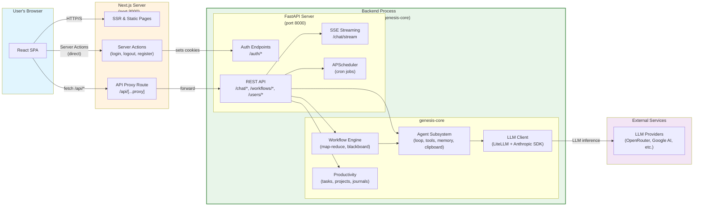
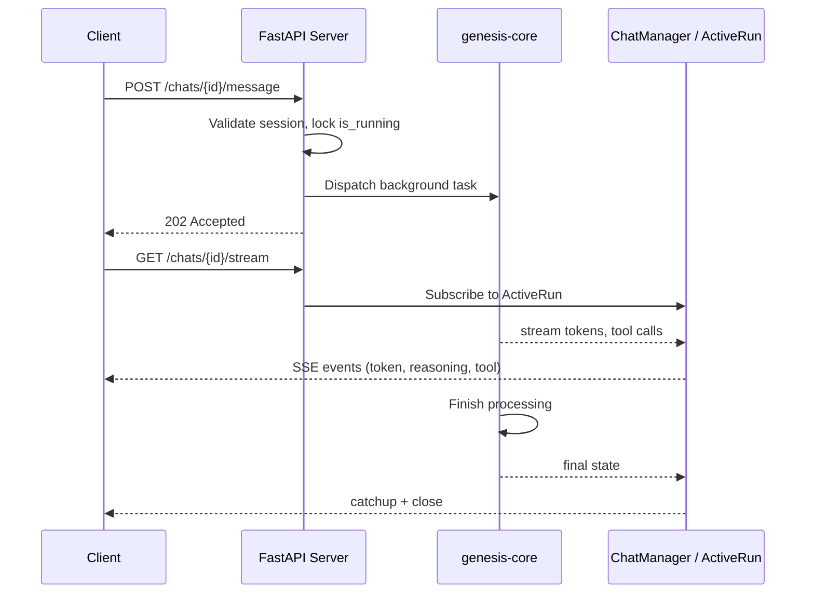

# Architecture

## Documentation index

This section lists the top-level documentation files that describe different parts of the system. For a detailed module map, see [module_reference.md](./module_reference.md).

### System-level

| File | Description |
|---|---|
| [module_reference.md](./module_reference.md) | Detailed module map of all packages and their responsibilities |
| [settings.md](./settings.md) | Environment variables and config fields consumed by `genesis-core.configs.Config` |
| [database.md](./database.md) | Database architecture, SQLModel models, engines, sessions, and access patterns |
| [development.md](./development.md) | Local setup, tooling, and coding conventions |
| [testing.md](./testing.md) | Testing conventions and patterns |
| [documentation.md](./documentation.md) | Standards for writing and maintaining docs |
| [logging.md](./logging.md) | Centralized logging configuration and log levels |

### Authentication and sessions

| File | Description |
|---|---|
| [authentication.md](./authentication.md) | JWT structure, login/logout, token refresh, Edge Middleware |

### Frontend

| File | Description |
|---|---|
| [frontend_architecture.md](./frontend_architecture.md) | Next.js app structure, routing, and key design decisions |
| [frontend_data_flow.md](./frontend_data_flow.md) | Browser to Next.js to FastAPI communication paths, including optimistic mutation flow |
| [frontend_layout_system.md](./frontend_layout_system.md) | CSS constraints, flex layout rules, PageContainer pattern |
| [frontend_component_tree.md](./frontend_component_tree.md) | Full component hierarchy from HTML root to page level, including provider wrappings |
| [frontend_components/task-list-provider.md](./frontend_components/task-list-provider.md) | Optimistic state container for the task list (context, reducer, dispatch semantics) |
| [frontend_components/task-table.md](./frontend_components/task-table.md) | TaskTable component (variants, columns, data source, floating bar) |

### Backend

| File | Description |
|---|---|
| [backend_architecture.md](./backend_architecture.md) | FastAPI DI system, router architecture, startup lifecycle |
| [fastapi_reference.md](./fastapi_reference.md) | Complete REST API endpoint reference |
| [chat_token_streaming.md](./chat_token_streaming.md) | SSE streaming from LLM tokens to browser via ActiveRun |
| [scheduled_workflow.md](./scheduled_workflow.md) | APScheduler cron registration and just-in-time workflow execution |

### Core subsystems

| File | Description |
|---|---|
| [sandbox_filesystem.md](./sandbox_filesystem.md) | Path-safe filesystem abstraction with sandbox boundary enforcement |
| [llm_client.md](./llm_client.md) | LiteLLM and Anthropic SDK integration, token streaming |
| [agent_loop.md](./agent_loop.md) | Agent loop architecture, step execution, tool call handling |
| [agent_tool.md](./agent_tool.md) | Tool class hierarchy, execution lifecycle, entity pinning |
| [agent_clipboard.md](./agent_clipboard.md) | Ephemeral working memory and context injection |
| [agent_manifests.md](./agent_manifests.md) | Agent Markdown manifest format |
| [workflow_architecture.md](./workflow_architecture.md) | Workflow engine, blackboard state, step execution |
| [workflow_manifest.md](./workflow_manifest.md) | Writing workflow YAML manifests |
| [workflow_task.md](./workflow_task.md) | Building new workflow task types |
| [productivity_subsystem.md](./productivity_subsystem.md) | Productivity data models and service layer |
| [using_productivity_subsystem.md](./using_productivity_subsystem.md) | Using the productivity subsystem |
| [providers.md](./providers.md) | LLM provider configuration |

## Runtime architecture

At runtime, the system comprises three processes: the FastAPI server, the NextJS server, and ReactJS components sitting in user's web browser. The system also calls external LLM providers for LLM inference necessary to drive the agents.



### Bidirectional communication with SSE

Some operations produce output over an extended period — streaming LLM tokens, live workflow progress, or long-running agent tasks. Rather than holding an HTTP connection open for minutes, the system uses a two-phase pattern:

1. **POST** — client sends a request (e.g., send a chat message)
2. **202 Accepted** — server immediately returns with a reference ID and starts background work
3. **GET /stream** — client opens a separate SSE endpoint using that ID to receive real-time events



This pattern is used for:
- **Chat streaming** — tokens and reasoning chunks delivered as SSE events while the agent runs
- **Workflow progress** — step start/complete/failed events broadcast to subscribed clients

## Package architecture

The repository is a monorepo with Python backend and TypeScript frontend as separate workspaces.

```
genesis-scaffolding/
├── pyproject.toml           # uv workspace root — manages Python packages
├── Makefile                 # Build, dev, and test commands
├── genesis-core/            # Core Python library — agent, LLM, workflow, productivity
├── genesis-tools/           # Tool implementations — file, web, arxiv, productivity
├── genesis-server/          # FastAPI REST API — routers, auth, scheduler
├── genesis-cli/             # CLI entrypoint (single-user mode)
├── genesis-tui/             # Terminal UI (stub)
└── genesis-frontend/        # Next.js React app — separate Node workspace
```

**Python packages** — managed by uv workspace in `pyproject.toml`:

| Package | Role | Depends on |
|---------|------|-------------|
| `genesis-core` | Shared logic — agent loop, LLM client, workflow engine, productivity models | — |
| `genesis-tools` | Tool implementations for agents | genesis-core |
| `genesis-server` | FastAPI API | genesis-core, genesis-tools |
| `genesis-cli` | CLI commands | genesis-core |
| `genesis-tui` | Textual TUI (stub) | genesis-core |

**Frontend** — separate Node workspace (`genesis-frontend/`), not part of the uv workspace. Communicates with `genesis-server` over HTTP via API proxy route.

**Full module reference** — see [module_reference.md](./module_reference.md) for the detailed module map of all packages.
