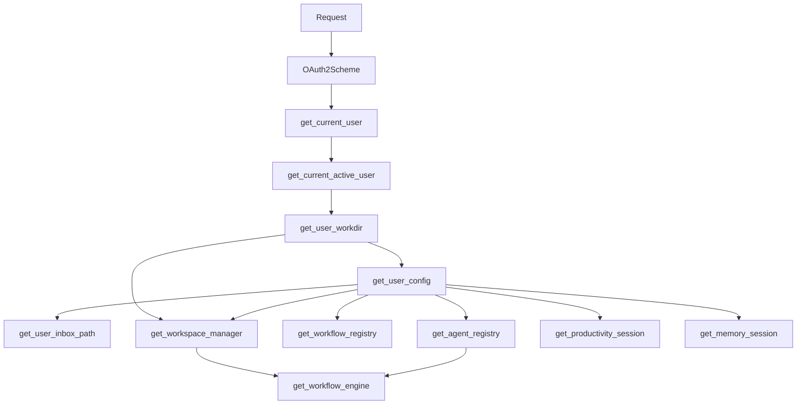
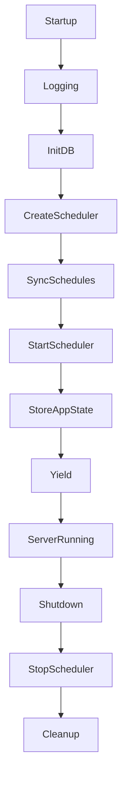

# Backend Architecture

## Overview

The `genesis-server` package is the FastAPI backend that enables multi-user mode. It runs as a standalone HTTP server and provides:

- Authentication via OAuth2 password flow with JWT tokens
- A server-level SQLite database for user accounts and session metadata
- User-scoped subsystems: agent registry, workflow registry, workspace manager, workflow engine, and scheduler manager
- REST API endpoints for all user-facing operations, supplied via dependency injection

Location: `genesis-server/src/genesis_server/`

## Authentication and JWT

The auth subsystem uses OAuth2 password flow with short-lived access tokens and long-lived refresh tokens.

### Token flow

1. User submits `username` and `password` to `POST /auth/login`
2. Server verifies credentials against the server database
3. Server issues two JWTs:
   - Access token — short-lived (600 minutes default), encodes `sub` (username) and `exp`
   - Refresh token — long-lived (7 days default), encodes `sub`, `exp`, and `type: refresh`
4. Client stores both tokens. All subsequent API requests send the access token in `Authorization: Bearer <token>`
5. When the access token expires, client calls `POST /auth/refresh` with the refresh token to obtain a new pair

### Password hashing

Passwords are hashed using `pwdlib` (Argon2id algorithm) and stored in the server database. The `User` model holds `username`, `email`, `hashed_password`, and a `disabled` flag.

### Relevant files

- `auth/security.py` — `create_access_token`, `create_refresh_token`, `decode_token_payload`, `verify_password`, `get_password_hash`
- `models/user.py` — `User` SQLModel table
- `routers/auth.py` — login and refresh endpoints

## Dependency Injection System

The backend uses FastAPI's dependency injection to thread user context and user-scoped managers through every request. All dependencies are defined in `dependencies.py`.

### Injection chain



### Core dependencies

| Dependency | Returns | Scope |
|---|---|---|
| `get_session` | `Session` | Server-level SQLModel session for the server database |
| `get_server_settings` | `Config` | Global server configuration |
| `get_current_user` | `User` | Decodes JWT, queries the server database, returns the authenticated user |
| `get_current_active_user` | `User` | Same as above but raises 400 if the user is disabled |

### User isolation dependencies

| Dependency | Returns | Description |
|---|---|---|
| `get_user_workdir` | `Path` | Resolves `server_users_directory/<user_id>/`, creates it if absent |
| `get_user_config` | `Config` | Loads the user's `config.yaml` merged with global defaults |
| `get_user_inbox_path` | `Path` | The user's working directory where workflow input files are placed |

### User-scoped managers

| Dependency | Returns | Description |
|---|---|---|
| `get_agent_registry` | `AgentRegistry` | Scans agent markdown files from the user's agent search paths |
| `get_workflow_registry` | `WorkflowRegistry` | Scans workflow YAML files from the user's workflow search paths |
| `get_workspace_manager` | `WorkspaceManager` | Manages per-job workspace directories under the user's workspace root |
| `get_workflow_engine` | `WorkflowEngine` | Executes workflows using the user's workspace and agent registry |
| `get_productivity_session` | `Session` | Opens a session on the user's private productivity SQLite database |
| `get_memory_session` | `Session` | Opens a session on the user's private memory SQLite database |

### System-level dependencies

| Dependency | Returns | Description |
|---|---|---|
| `get_scheduler_manager` | `SchedulerManager` | Global APScheduler manager stored in `request.app.state` |

### Type aliases

For cleaner route signatures, `dependencies.py` exports reusable type aliases that combine an `Annotated` type with a `Depends` call:

```python
UserConfigDep = Annotated[Config, Depends(get_user_config)]
AgentRegDep = Annotated[AgentRegistry, Depends(get_agent_registry)]
WorkflowRegDep = Annotated[WorkflowRegistry, Depends(get_workflow_registry)]
WorkspaceDep = Annotated[WorkspaceManager, Depends(get_workspace_manager)]
EngineDep = Annotated[WorkflowEngine, Depends(get_workflow_engine)]
ProdSessionDep = Annotated[Session, Depends(get_productivity_session)]
MemorySessionDep = Annotated[Session, Depends(get_memory_session)]
```

Routers use these aliases so individual route handlers only declare the managers they need, without repeating the `Depends()` boilerplate.

## Router Architecture

### Pattern

All routers follow the same pattern: a FastAPI `APIRouter` with a `prefix` and `tags`. Route handlers declare the dependencies they need via type-annotated parameters. User-scoped routers require authentication, system-level routers do not.

See [FastAPI Reference](fastapi_reference.md) for the full endpoint inventory.

### Common patterns

**Authenticated routes** — inject `User` via `get_current_active_user`. User isolation is automatic because all downstream managers are also injected via the DI chain:

```python
@router.get("/", response_model=list[AgentRead])
async def list_agents(agent_reg: AgentRegDep):
    ...
```

**Background tasks** — long-running operations (chat, workflow execution) are dispatched as background tasks. The route returns `202 Accepted` immediately and the background task performs the actual work:

```python
@router.post("/{session_id}/message")
async def send_message(..., background_tasks: BackgroundTasks, ...):
    background_tasks.add_task(run_agent_task)
    return {"status": "accepted", "message": "Agent is thinking..."}
```

## Server Startup and Shutdown

The server lifecycle is managed by a FastAPI `lifespan` function in `main.py`. This runs before the first request and after the last request.



### Startup sequence

1. `setup_logging(config.log_level)` — configure logging level
2. `init_db()` — create the server SQLite database, run table migrations via SQLModel, seed the admin user if configured via environment variables
3. `SchedulerManager()` — create the global APScheduler instance
4. `await sm.sync_schedules()` — load all enabled cron schedules from the database into the scheduler
5. `sm.start()` — start the APScheduler event loop
6. Store `sm` and `ChatManager` in `app.state` so routes can reach them

### Shutdown sequence

When the server stops, `sm.stop()` shuts down the APScheduler. Background tasks for chat and workflow jobs should complete or be cancelled by the OS.

### Relevant files

- `main.py` — FastAPI app, lifespan, router registration, CORS middleware
- `database.py` — `init_db`, engine, `get_session` dependency
- `scheduler.py` — `SchedulerManager`, `_execute_scheduled_task`
- `chat_manager.py` — `ChatManager`, `ActiveRun` (SSE run registry)
