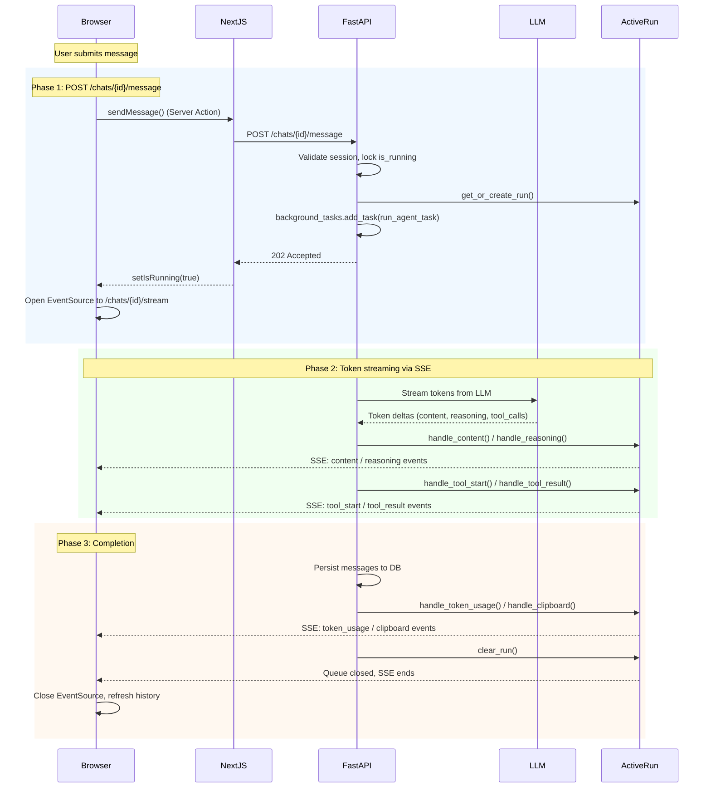

# Chat Token Streaming Architecture

## Overview

Chat messages are streamed live to the browser using Server-Sent Events (SSE). Tokens arrive incrementally from the LLM and are rendered in real time without waiting for the agent to finish. This document describes the end-to-end path from the moment the user submits a message to the moment the UI updates with the final state.

The system uses a two-phase request pattern:

1. **POST** — client sends the message, server starts the agent in the background and returns immediately with `202 Accepted`
2. **SSE** — client opens a separate long-lived connection to receive live events

## Request Flow



## Phase 1: Submitting a Message

### Frontend: Server Action

When the user submits a message in `ChatInput`, `ChatContext.sendMessage()` is called. It:

1. Sets `isRunning = true` to show the running indicator immediately
2. Appends the user's message optimistically to `activeRunRef` so it appears instantly
3. Calls `sendChatMessageAction(sessionId, input, inputIndex)` — a Next.js Server Action

```typescript
// chat-context.tsx
const sendMessage = async (input: string, inputIndex?: number) => {
  setIsRunning(true);
  activeRunRef.current = [{ role: 'user', content: input }];
  await sendChatMessageAction(session.id, input, inputIndex);
};
```

The Server Action proxies the request through Next.js to `POST /api/chats/{id}/message`, which forwards it to FastAPI.

### FastAPI: Route Handler

`routers/chat.py` handles the POST at `POST /chats/{session_id}/message`:

1. Validates the session belongs to the authenticated user
2. Checks the `is_running` flag — if the agent is already processing, returns `409 Conflict`
3. Reconstructs the agent's memory from the message history stored in the database
4. Calls `chat_manager.get_or_create_run()` to get or create the `ActiveRun` for this session
5. Adds `run_agent_task` as a FastAPI `BackgroundTask`
6. Sets `chat_session.is_running = True` in the database
7. Returns `202 Accepted` immediately

```python
@router.post("/{session_id}/message")
async def send_message(
    session_id: int,
    background_tasks: BackgroundTasks,
    request: Request,
    ...
):
    agent = agent_reg.create_agent(chat_session.agent_id, ...)
    chat_manager: ChatManager = request.app.state.chat_manager
    active_run = chat_manager.get_or_create_run(session_id, user_input=user_input)
    background_tasks.add_task(run_agent_task)
    chat_session.is_running = True
    db.commit()
    return {"status": "accepted", "message": "Agent is thinking..."}
```

### FastAPI: Background Task

`run_agent_task` executes in a background thread or coroutine and is entirely decoupled from the HTTP response cycle:

1. Runs `agent.step()` with the user input and callback handlers
2. After the agent finishes, persists new messages to the database
3. Updates `clipboard_state`, `updated_at`, and clears `is_running`
4. Broadcasts final state via `ActiveRun` callbacks
5. Calls `chat_manager.clear_run(session_id)` to close all SSE queues

### Opening the SSE Connection

Simultaneously with sending the POST, the frontend opens an `EventSource` to `GET /api/chats/{session_id}/stream`. This connection persists until the agent finishes.

```typescript
// chat-context.tsx
const eventSource = new EventSource(`/api/chats/${session.id}/stream`);

eventSource.addEventListener('catchup', (e) => {
  activeRunRef.current = e.data.interim_messages;
});
```

## Phase 2: Token Streaming

### LLM Client to Agent Callback

When `agent.step()` is called with `stream=True`, it passes callback lists to the LLM client:

```python
await agent.step(
    input=user_input,
    stream=True,
    content_chunk_callbacks=[active_run.handle_content],
    reasoning_chunk_callbacks=[active_run.handle_reasoning],
    tool_start_callback=[active_run.handle_tool_start],
    tool_result_callback=[active_run.handle_tool_result],
)
```

These callbacks are typed as `StreamCallback` and `ToolCallback`:

```python
# schemas.py
StreamCallback = Callable[[str], Awaitable[None]]
ToolCallback = Callable[[str, dict[str, Any]], Awaitable[None]]
```

### LiteLLM Streaming Handler

The LiteLLM client iterates over the streaming response from the LLM provider. For each chunk it extracts content delta, reasoning delta, and tool call fragments, then invokes the registered callbacks:

```python
# _litellm.py
async for chunk in response:
    content = getattr(choice.delta, "content", "") or ""
    if content and content_chunk_callbacks:
        await asyncio.gather(*[cb(content) for cb in content_chunk_callbacks])

    reasoning = getattr(choice.delta, "reasoning_content", "") or ""
    if reasoning and reasoning_chunk_callbacks:
        await asyncio.gather(*[cb(reasoning) for cb in reasoning_chunk_callbacks])
```

Anthropic SDK follows the same pattern via `_parse_anthropic_stream()`.

### ActiveRun: Broadcasting to SSE

`ActiveRun` maintains a list of `asyncio.Queue` instances — one per connected SSE client. Every callback call appends the data to the in-memory message list and broadcasts to all queues:

```python
# chat_manager.py
async def handle_content(self, chunk: str):
    idx = self._get_or_create_assistant_message_index()
    self.messages[idx]["content"] += chunk
    await self._broadcast("content", chunk, index=idx)
```

The broadcast sends a structured payload with the event name, the raw delta data, and the message index so the frontend knows which message to update.

### FastAPI SSE Endpoint

`GET /chats/{session_id}/stream` returns a `StreamingResponse` backed by an async generator:

```python
# chat.py
async def event_generator():
    yield f"event: catchup\ndata: {json.dumps({'interim_messages': active_run.messages})}\n\n"

    while True:
        item = await client_queue.get()
        if item is None:  # Sentinel: stream ended
            break
        yield f"event: {item['event']}\ndata: {json.dumps(item['data'])}\n\n"
```

The SSE format is `event: {name}\ndata: {json}\n\n`. The first `catchup` event sends all messages already produced so far, ensuring the client is never behind.

### API Proxy Passthrough

The Next.js API proxy route (`app/api/[...proxy]/route.ts`) detects the SSE content type and passes the response body directly without buffering:

```typescript
if (contentType?.includes('text/event-stream')) {
  return new NextResponse(response.body, {
    headers: {
      'Content-Type': 'text/event-stream',
      'X-Accel-Buffering': 'no',
    },
  });
}
```

`X-Accel-Buffering: no` prevents nginx-compatible proxies from buffering the stream.

### Frontend SSE Client

`ChatContext` registers event listeners on the `EventSource`. Each event type maps to a specific update:

| Event | Frontend action |
|---|---|
| `catchup` | Replace `activeRunRef` with all interim messages |
| `content` | Append chunk to `content` field at `index` |
| `reasoning` | Append chunk to `reasoning_content` field at `index` |
| `tool_start` | Push new tool call with `status: running` |
| `tool_result` | Push new `tool` message, mark running tool as completed |
| `token_usage` | Update token usage display |
| `clipboard` | Update clipboard markdown display |

The catchup event is critical: if the agent is already producing tokens when the EventSource connects, the client still sees them.

### Debounced Rendering

The frontend debounces DOM updates at 10 fps (every 100ms) while `isRunning = true`:

```typescript
// chat-context.tsx
const interval = setInterval(() => {
  setDisplayActiveMessages(activeRunRef.current.map(...));
}, 100);
```

This prevents React re-renders from blocking the UI thread when tokens arrive rapidly. The `MessageBubble` component also uses a custom comparison function so it only re-renders when content, reasoning, or tool status actually changes.

## Phase 3: Completion

When `agent.step()` returns (agent reaches a conclusion or max turns), the background task:

1. Extracts all new messages from `agent.memory.messages`
2. Writes them to the database via `ChatMessage` records
3. Serializes and saves `agent.memory.agent_clipboard`
4. Sets `is_running = False` on the session
5. Broadcasts `token_usage` and `clipboard` events with final state
6. Calls `clear_run()` — puts `None` into all SSE queues to signal end-of-stream

When the SSE queues close, the frontend `EventSource` fires `onerror`, which triggers:

1. `eventSource.close()` — stops listening
2. `refreshHistory()` — fetches the persisted message history from the database to replace the optimistic state with the authoritative record

## Key Files

### Backend

| File | Role |
|---|---|
| `genesis-server/src/genesis_server/routers/chat.py` | POST message route, SSE stream route, background task |
| `genesis-server/src/genesis_server/chat_manager.py` | `ActiveRun` broadcasting, `ChatManager` run registry |
| `genesis-server/src/genesis_server/dependencies.py` | `get_user_inbox_path` and `get_agent_registry` for user isolation |
| `genesis-core/src/genesis_core/agent/agent.py` | `Agent.step()` calling LLM with callbacks |
| `genesis-core/src/genesis_core/llm/__init__.py` | `get_llm_response()` routing to provider |
| `genesis-core/src/genesis_core/llm/_litellm.py` | LiteLLM streaming iteration, callback invocation |
| `genesis-core/src/genesis_core/llm/_anthropic.py` | Anthropic SDK streaming, callback invocation |
| `genesis-core/src/genesis_core/schemas.py` | `StreamCallback`, `ToolCallback` type definitions |

### Frontend

| File | Role |
|---|---|
| `genesis-frontend/components/chat/chat-context.tsx` | `ChatProvider`, SSE connection, event handlers, debouncing |
| `genesis-frontend/components/chat/message-list.tsx` | Scroll management, auto-scroll, edit trigger |
| `genesis-frontend/components/chat/message-bubble.tsx` | Renders single message, tool status badges |
| `genesis-frontend/app/actions/chat.ts` | Server Actions: `sendChatMessageAction`, `getChatHistoryAction` |
| `genesis-frontend/app/api/[...proxy]/route.ts` | API proxy with SSE passthrough support |
| `genesis-frontend/lib/api-client.ts` | `apiFetch` with token refresh and auth header injection |