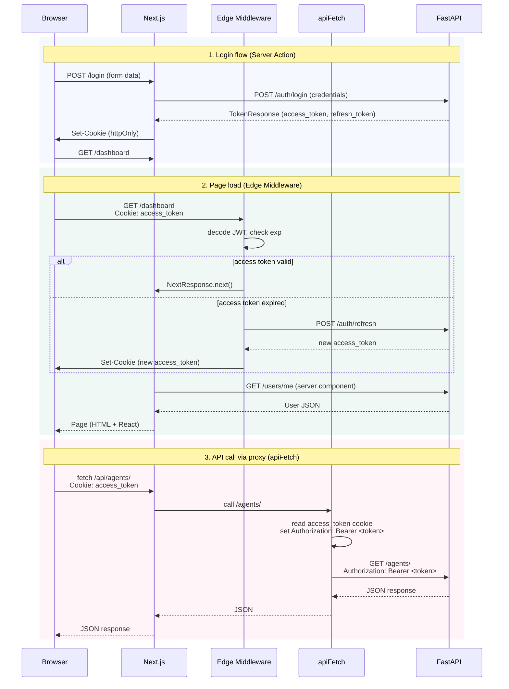

# Data Flow: Browser, Next.js, and FastAPI

The browser never talks to FastAPI directly. Every request goes to Next.js first, which either handles it directly or forwards it to FastAPI.

## Two Communication Paths

### Server Actions (auth only)

Used for login, logout, and registration. These operations must call FastAPI directly because they need to receive and set session cookies on the browser.

```
Browser → Server Action → FastAPI → Set-Cookie on response → Browser
```

Flow:
1. User submits form
2. Server Action calls `authenticateUser()` in `lib/auth.ts`
3. `authenticateUser()` POSTs credentials to `http://localhost:8000/auth/login`
4. On success, FastAPI returns access_token and refresh_token
5. Server Action calls `createSession()` in `lib/session.ts` to set httpOnly cookies
6. Browser stores the cookies automatically

Key files:
- `app/actions/auth.ts` — loginAction, logoutAction, registerAction
- `lib/auth.ts` — authenticateUser, refreshAccessToken
- `lib/session.ts` — createSession, getAccessToken, deleteSession

### API Proxy (all other calls)

Used for chat, workflows, tasks, projects, and everything else.

```
Browser → GET /api/[path] → Next.js route handler → apiFetch → FastAPI
```

Flow:
1. Browser calls `/api/agents/`, `/api/chats/`, etc.
2. Next.js route handler `app/api/[...proxy]/route.ts` receives the request
3. Route handler calls `apiFetch()` from `lib/api-client.ts`
4. `apiFetch()` reads `access_token` from cookies
5. `apiFetch()` sets `Authorization: Bearer <token>` header
6. `apiFetch()` POSTs to FastAPI and returns the response

Key files:
- `app/api/[...proxy]/route.ts` — GET and POST route handlers
- `lib/api-client.ts` — apiFetch, apiGet, apiPost, apiPut, apiDelete

## How apiFetch Works

```typescript
// lib/api-client.ts (simplified)
export async function apiFetch(endpoint, options = {}) {
  const accessToken = await getAccessToken();        // Read cookie
  headers.set('Authorization', `Bearer ${accessToken}`);  // Inject token

  let response = await fetch(`${FASTAPI_URL}${endpoint}`, { headers });

  // If FastAPI returns 401, try token refresh
  if (response.status === 401) {
    const refreshed = await refreshAccessToken(refreshToken);
    if (refreshed) {
      await createSession(refreshed.access_token, refreshed.refresh_token, ...);
      headers.set('Authorization', `Bearer ${refreshed.access_token}`);
      response = await fetch(`${FASTAPI_URL}${endpoint}`, { headers });  // Retry
    }
  }

  return response;
}
```

## Where Token Injection Happens

Token injection is the step of reading the access token from a cookie and attaching it as the `Authorization: Bearer` header on outgoing requests. It happens in two places:

1. **Edge Middleware (`proxy.ts`)** — Intercepts all requests before they reach any page or route. Checks if access token is expired. If so, calls `POST /auth/refresh` and sets a new cookie on the response before forwarding.

2. **apiFetch (`lib/api-client.ts`)** — Attaches the token to every API call made through the proxy route. Also handles 401 with automatic refresh.

## Server Actions Pattern

Server Actions live in `app/actions/` and are marked with `'use server'`. They run on the Next.js server, can access cookies and headers, and return data to client components.

Example pattern from `app/actions/chat.ts`:

```typescript
'use server'

import { apiFetch } from "@/lib/api-client";

export async function getAgentsAction(): Promise<Agent[]> {
  const res = await apiFetch(`/agents/`);
  if (!res.ok) throw new Error("Failed to fetch agents");
  return res.json();
}

export async function createAgentAction(data: AgentCreate): Promise<Agent> {
  const res = await apiFetch(`/agents/`, {
    method: 'POST',
    headers: { 'Content-Type': 'application/json' },
    body: JSON.stringify(data),
  });
  revalidatePath('/dashboard/agents');  // Refresh the page data
  return res.json();
}
```

## Request Flow Summary



The three flows cover the complete lifecycle:
1. **Login** — Server Action calls FastAPI directly, receives tokens, sets httpOnly cookies
2. **Page load** — Edge Middleware checks token expiry and refreshes if needed before the page renders
3. **API call** — Browser fetches the proxy route, apiFetch injects the token, FastAPI returns data

## Authentication Reference

For complete auth details — JWT structure, token refresh flow, logout, and known limitations — see [authentication.md](./authentication.md).