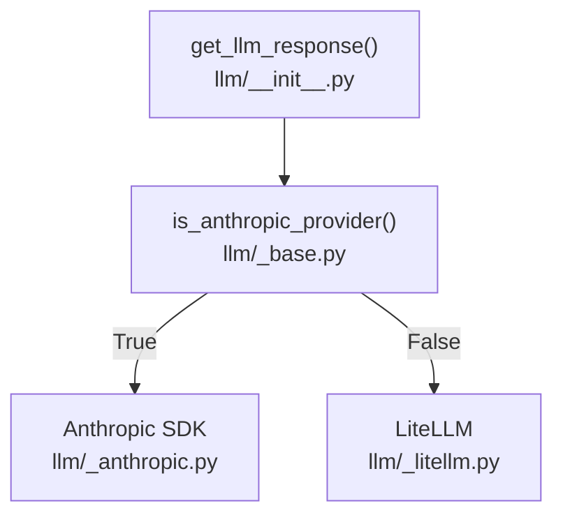

# LLM Client Architecture

## Overview

The `genesis-core.llm` package provides a provider-agnostic interface to LLM backends. A single entry point — `get_llm_response()` — accepts a standardized request and routes it to the appropriate backend implementation based on the provider configuration.

## Architecture



The routing decision is made by `is_anthropic_provider()`, which checks if the provider name is `"minimax"`. If true, the request goes to the Anthropic SDK. All other providers use LiteLLM, which handles OpenAI-compatible APIs.

Both implementations expose the same function signature and return the same response type, so callers are unaware which backend is active.

## Shared Interface

### Request parameters

All implementations accept the same parameters:

```python
async def get_llm_response(
    llm_model_config: LLMModelConfig,
    provider_config: LLMProvider,
    messages: list[dict],
    stream: bool = False,
    content_chunk_callbacks: list[StreamCallback] | None = None,
    reasoning_chunk_callbacks: list[StreamCallback] | None = None,
    tools: list[dict] | None = None,
) -> LLMResponse
```

| Parameter | Type | Description |
|---|---|---|
| `llm_model_config` | `LLMModelConfig` | Model nickname, actual model string, and extra params |
| `provider_config` | `LLMProvider` | Provider name, base URL, and API key |
| `messages` | `list[dict]` | Message list in OpenAI format |
| `stream` | `bool` | Whether to stream the response |
| `content_chunk_callbacks` | `list[StreamCallback]` | Callbacks invoked per content token |
| `reasoning_chunk_callbacks` | `list[StreamCallback]` | Callbacks invoked per reasoning/thinking token |
| `tools` | `list[dict]` | Tool definitions in OpenAI function-calling format |

### Response type

```python
class LLMResponse(BaseModel):
    content: str
    reasoning_content: str
    tool_calls: list[ToolCall]
```

`content` holds the final assembled text. `reasoning_content` holds extended thinking output when the model supports it. `tool_calls` is a list of tool call requests, each with an `id`, `function_name`, and JSON `arguments` string.

### Callback types

```python
StreamCallback = Callable[[str], Awaitable[None]]
ToolCallback = Callable[[str, dict[str, Any]], Awaitable[None]]
```

Callbacks are invoked during streaming mode. Each callback receives a token delta as a string and should be defined as an async function. The callbacks are registered by the caller (e.g., `agent.step()`) and passed all the way through to the LLM client, which invokes them as each token arrives from the stream.

## LiteLLM Implementation

**File:** `genesis-core/src/genesis_core/llm/_litellm.py`

LiteLLM handles OpenAI-compatible providers — any API that accepts the OpenAI chat completion format. The client uses `acompletion()` with a model string in the format `{provider.name}/{model_name}`.

### Non-streaming mode

The response is a `ModelResponse`. The client extracts `content`, `reasoning_content`, and `tool_calls` from `response.choices[0].message`.

### Streaming mode

The response is a `CustomStreamWrapper`. The client iterates over it asynchronously:

```python
async for chunk in response:
    content = getattr(choice.delta, "content", "") or ""
    if content and content_chunk_callbacks:
        await asyncio.gather(*[cb(content) for cb in content_chunk_callbacks])
```

For tool calls, arguments arrive incrementally as partial JSON strings. The client accumulates them per tool call index:

```python
tool_calls_dict[idx] = {"id": "", "name": "", "args": ""}
# Each delta appends to the fields
tool_calls_dict[idx]["args"] += tc.function.arguments
```

The full `ToolCall` is assembled only after the stream completes.

### Tool format

Tools are passed in OpenAI function-calling format directly to LiteLLM. No conversion is required.

## Anthropic SDK Implementation

**File:** `genesis-core/src/genesis_core/llm/_anthropic.py`

The Anthropic SDK is used for MiniMax and any other provider that is API-compatible with Anthropic but has issues with LiteLLM. The SDK handles message batching, streaming context management, and block-type content natively.

### Message conversion

Anthropic does not accept `role=system` in the messages array. The SDK extracts system messages and passes them as a separate `system` parameter instead. Tool messages become `user` role messages with `tool_result` content blocks. Assistant messages with `tool_calls` become messages with `tool_use` content blocks.

```python
# System messages — extracted and passed separately
if role == "system":
    system_parts.append(content)  # combined into system param

# Tool messages — converted to user messages with tool_result blocks
if role == "tool":
    {"role": "user", "content": [{"type": "tool_result", "tool_use_id": "...", "content": "..."}]}

# Assistant with tool_calls — converted to tool_use blocks
if role == "assistant" and msg.get("tool_calls"):
    {"role": "assistant", "content": [{"type": "tool_use", "id": "...", "name": "...", "input": {...}}]}
```

### Tool conversion

The SDK uses `input_schema` instead of `parameters`. The conversion function renames the field while keeping the JSON schema unchanged:

```python
{"type": "tool", "name": "...", "description": "...", "input_schema": func["parameters"]}
```

### Streaming

The SDK uses an async context manager `client.messages.stream()`:

```python
async with client.messages.stream(**params) as stream:
    async for event in stream:
        ...
```

Event types handled:

- `content_block_start` — initializes a `tool_calls_dict` entry when a `tool_use` block begins
- `content_block_delta` — `text_delta` delivers content tokens, `thinking_delta` delivers reasoning tokens, `input_json_delta` delivers tool argument fragments

## Token Utilities

**File:** `genesis-core/src/genesis_core/llm/token_utils.py`

Exports `count_tokens()` and `get_max_context_tokens()`. Used by `AgentMemory` to track context window usage and by the frontend token bar. Provider-specific token counting is handled by LiteLLM or the Anthropic SDK depending on the model.

## Key Files

| File | Role |
|---|---|
| `genesis-core/src/genesis_core/llm/__init__.py` | `get_llm_response()` entry point, routing logic |
| `genesis-core/src/genesis_core/llm/_base.py` | `is_anthropic_provider()` routing predicate |
| `genesis-core/src/genesis_core/llm/_litellm.py` | LiteLLM client, streaming iteration, callback invocation |
| `genesis-core/src/genesis_core/llm/_anthropic.py` | Anthropic SDK client, message conversion, streaming |
| `genesis-core/src/genesis_core/llm/token_utils.py` | Token counting utilities |
| `genesis-core/src/genesis_core/schemas.py` | `LLMProvider`, `LLMModelConfig`, `LLMResponse`, `StreamCallback`, `ToolCallback` |