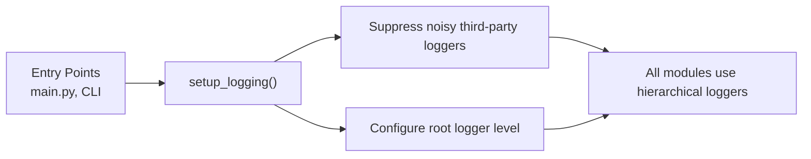

# Logging

## Overview

The application uses Python's standard `logging` module. Configuration is centralized in `genesis_core/logging_config.py` and controlled via the `Config` system. All backend modules use hierarchical loggers via `logging.getLogger(__name__)`.

## Architecture



### Key principles

1. **Libraries do not configure logging** — they only use loggers. Only entry points call `setup_logging()`.
2. **Configure once at entry point** — `setup_logging()` must be called before any imports that use logging.
3. **Hierarchical loggers** — child loggers inherit from parents, so setting level on root affects all.
4. **Lazy evaluation** — always use `%-formatting` instead of f-strings so arguments are only formatted when the log level is enabled.

### Log levels

| Level | When to use |
|---|---|
| DEBUG | Dev details, loop iterations, variable states |
| INFO | Significant milestones, successful operations |
| WARNING | Recoverable issues, degraded behavior |
| ERROR | Operation failed but the app continues |
| CRITICAL | App is unusable, will exit |

## Configuration

### Via environment variable

Set `GENESIS__LOG_LEVEL` in your `.env` file or shell environment:

```bash
genesis__log_level=DEBUG
```

Valid values: `DEBUG`, `INFO`, `WARNING`, `ERROR`, `CRITICAL` (case-insensitive). Invalid values default to `WARNING`.

### Auto-DEBUG in dev mode

When running with `uvicorn --reload`, the log level is automatically set to `DEBUG` regardless of config. This is detected in `logging_config.py` via the `UVICORN_RELOAD` environment variable.

## Log output format

The default format is:

```
[%(name)s] %(levelname)s: %(message)s
```

Example output:

```
[genesis_core.agent.agent_registry] INFO: Loaded 3 agents
[uvicorn.error] INFO: Application startup complete.
```

The logger name shows the module hierarchy, making it easy to identify where the log originated.

## Suppressing noisy third-party logs

In `setup_logging()`, third-party loggers are set to `WARNING` while the application root logger uses the configured level. This suppresses verbose output from uvicorn, FastAPI, LiteLLM, httpx, and httpcore.

## Related documentation

- [developer_guides/adding_logging.md](developer_guides/adding_logging.md) — how to add logging to backend code