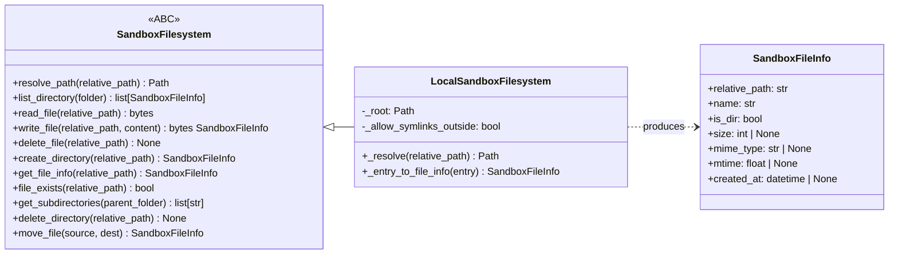
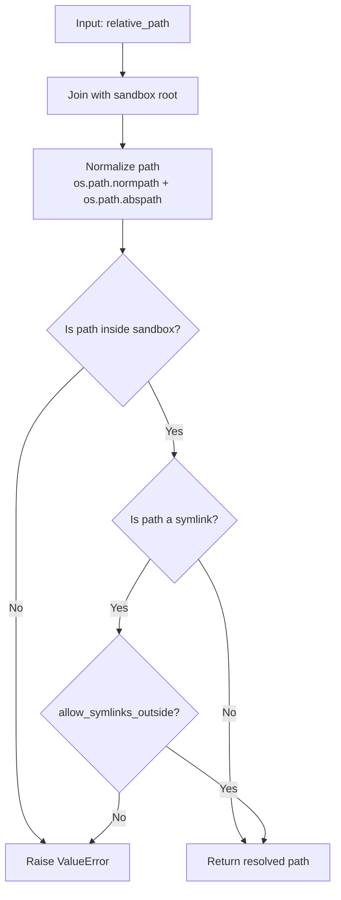

# Sandbox Filesystem

## Overview

The sandbox filesystem provides a path-safe abstraction for all file operations in the application. It enforces boundaries that prevent any file operation from escaping a user's designated working directory. This abstraction is used by the frontend API, agent tools, and CLI, making it the single source of truth for file access.

The design is swappable: a future S3-backed implementation can replace `LocalSandboxFilesystem` without changing any calling code.

## Architecture

### Class relationships



### `SandboxFilesystem` ABC

The abstract base class defines the interface that all implementations must provide. All paths passed to methods are relative to the sandbox root. Implementations must enforce boundary checks to prevent path traversal attacks.

**Key methods:**

| Method | Description |
|---|---|
| `resolve_path(relative_path)` | Resolve a relative path to an absolute path. Raises `ValueError` on traversal attempt. |
| `list_directory(folder)` | List entries in a folder. Returns empty list if folder does not exist. |
| `read_file(relative_path)` | Read file contents as bytes. Raises `FileNotFoundError` or `ValueError` if path is a directory. |
| `write_file(relative_path, content)` | Create or overwrite a file. Creates parent directories as needed. |
| `delete_file(relative_path)` | Delete a file. Raises `FileNotFoundError` or `ValueError` if path is a directory. |
| `create_directory(relative_path)` | Create a directory. Creates parent directories as needed. |
| `get_file_info(relative_path)` | Get metadata for a file or directory. Raises `FileNotFoundError` if path does not exist. |
| `file_exists(relative_path)` | Check if a path exists. Returns `False` for traversal attempts. |
| `get_subdirectories(parent_folder)` | Get immediate subdirectory paths. Returns sorted list of relative paths. |
| `delete_directory(relative_path)` | Delete an empty directory. Raises `ValueError` if directory is not empty. |
| `move_file(source, dest)` | Move a file within the sandbox. Only files are supported, not directories. |

### `SandboxFileInfo` dataclass

Defined in `genesis_core.schemas`, this is the return type for all file operations:

```python
@dataclass
class SandboxFileInfo:
    relative_path: str   # Path relative to sandbox root (stable identifier)
    name: str            # Filename without path
    is_dir: bool = False
    size: int | None = None
    mime_type: str | None = None
    mtime: float | None = None
    created_at: datetime | None = None
```

The `relative_path` field serves as the stable identifier for files. In URLs, it is base64url-encoded rather than passed as a raw path.

### `LocalSandboxFilesystem`

The default implementation using the local filesystem. Initialized with a sandbox root directory:

```python
LocalSandboxFilesystem(sandbox_root: Path, allow_symlinks_outside: bool = True)
```

The `allow_symlinks_outside` flag defaults to `True`, allowing users to symlink existing directories (such as an Obsidian vault or code repository) into their sandbox without copying files.

## Path traversal prevention

The `_resolve()` method enforces sandbox boundaries. It is called by every operation that accepts a relative path.



The normalization step handles `..` traversal and dot components before checking boundaries. This means paths like `../../../etc/passwd` are blocked regardless of symlink status.

```python
def _resolve(self, relative_path: str) -> Path:
    joined = self._root / relative_path
    normalized = Path(os.path.normpath(os.path.abspath(str(joined))))

    if not normalized.is_relative_to(self._root):
        raise ValueError(f"Traversal attempt detected: {relative_path}")

    if joined.is_symlink():
        resolved = joined.resolve()
        if not resolved.is_relative_to(self._root) and not self._allow_symlinks_outside:
            raise ValueError(f"Traversal attempt detected: {relative_path}")

    return normalized
```

## Integration points

### API router

The FastAPI router at `genesis_server/routers/files.py` uses `LocalSandboxFilesystem` for all file endpoints. File paths in URLs are base64url-encoded to avoid traversal issues in HTTP requests.

### Agent tools

File tools in `genesis_tools/file.py` receive the sandbox root path via framework-injected `working_directory` and use it to validate paths before calling the sandbox filesystem.

## Relationship to workflow workspace

The workflow workspace module (`genesis_core.workflow.workflow_workspace`) manages per-job directories with `input/`, `internal/`, and `output/` subdirectories. This is separate from the sandbox filesystem, which handles persistent user files.

Future refactoring could have workspace use `SandboxFilesystem` internally, but for now they remain distinct modules.

## Related documentation

- [agent_tool.md](agent_tool.md) — agent tools including file operations
- [backend_architecture.md](backend_architecture.md) — API router architecture
- [module_reference.md](module_reference.md) — `genesis_core.sandbox_filesystem.sandbox_filesystem`